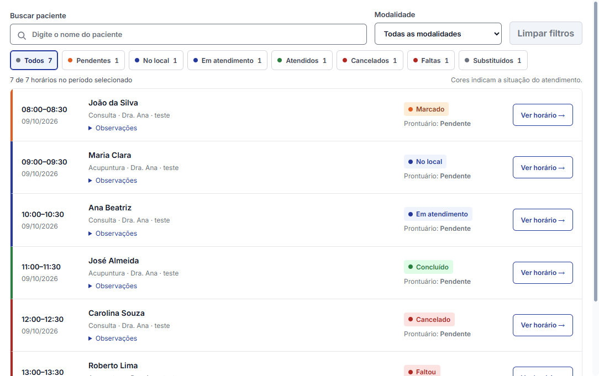
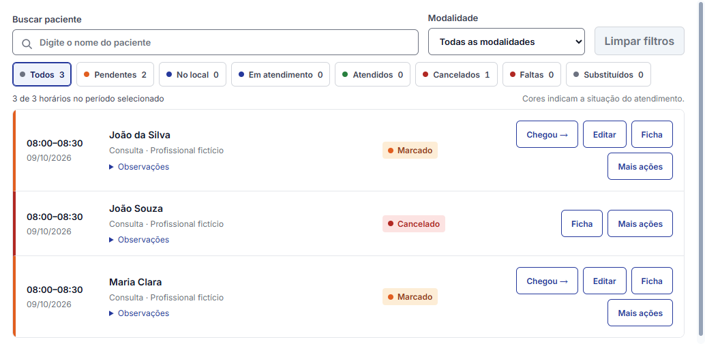
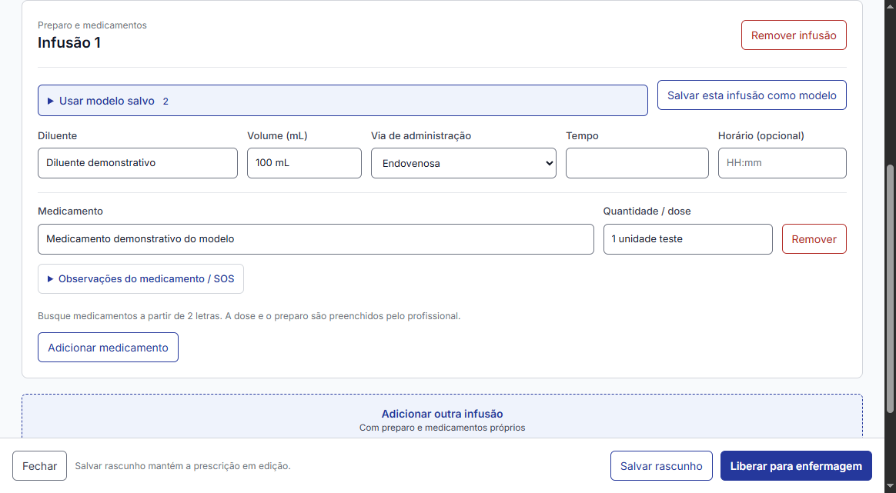

# Agenda e documentos — melhoria visual sobre a main

Base: `5cd5d55` (main consultada em 09/10/2026). Branch: `codex/agenda-documentos-cores`. A PR 245 não foi incorporada.

## Resultado

- Meu dia e lista diária da recepção: lista React como apresentação única, com lupa, busca sem distinguir acentos/maiúsculas, filtros combináveis por modalidade e situação, contagens e limpeza. Não há abas extras nem tabela duplicada.
- Grade multiprofissional e Minha semana: filtros React acima da grade existente, mantendo horários livres, bloqueios e ações administrativas. Em áreas estreitas, a situação usa um seletor compacto para preservar a área útil da grade.
- Rolagem: barras discretas e arredondadas, sem as setas antigas, tanto no HTML quanto nas telas nativas. Arraste, roda, teclado e cliques no trilho continuam disponíveis.
- Pendentes em âmbar; no local/em atendimento em azul; atendidos em verde; cancelamentos/faltas em vermelho; substituições em cinza. A cor sempre acompanha o texto da situação. A classificação usa status e etapa fornecidos pelo C#; não grava estado clínico pelo navegador.
- Editor da prescrição de infusão em React/TypeScript/CSS: preparo e medicamentos agrupados por infusão, medicamentos sugeridos pelo catálogo, modelos, copiar última, texto com negrito/itálico e rodapé com salvar/liberar acessível durante a rolagem.
- Ações nas listas de documentos e na folha: botões azuis contornados para abrir/copiar/imprimir/editar e vermelho para ações destrutivas. Essas listas continuam WPF.

## Integração e segurança

Os arquivos são locais em `WebClinica/wwwroot`, sem CDN. `PainelClinicoWeb` permite somente a origem local, bloqueia navegação externa, popups, downloads, frames e permissões do navegador. Cada mensagem revalida o usuário e as permissões; ações concorrentes são recusadas. As ações da lista resolvem IDs na coleção/contexto atual; a infusão aceita somente campos, comandos e IDs registrados, respeitando `CanExecute`.

As regras, persistência, confirmações e assinatura existentes continuam no host C#. Trata-se de melhoria das telas solicitadas, não de migração integral dos módulos. Confirmações administrativas e abertura de arquivos conservam os diálogos existentes.

## Verificação reproduzível

1. `npm ci` e `npm run build` em `src/Clinica.Desktop.Shell/WebClinica/frontend`.
2. `dotnet run --project tools/validar-agenda-documentos/Qa.csproj` (Windows com WebView2).
3. `dotnet test tests/Clinica.Tests/Clinica.Tests.csproj`.
4. `python tools/verificar-suite.py` e `python tools/compilar-sombra.py`.

O harness utiliza somente dados fictícios e SQLite em memória. Exercita busca sem acentos, filtros combinados, limpar, vazio/carga/erro, manutenção do foco, clique duplo, contexto e navegação bloqueados; testa MeuDiaView e FilaView reais e o editor real de infusão com adapter/ViewModel/banco. Na prescrição, cobre cancelar/aplicar modelo, salvar/reabrir com formatação, salvar modelo, liberação, cópia sem salvar automaticamente, IDs obsoletos, campos/vias inválidos e acesso negado.

Lista React verificada em 1440/1100/900/620 px; Meu dia real em 1366/1100/900 px; recepção em 1100/900 px; infusão em 1180/900/650 px. Evidências locais em `artifacts/agenda-documentos`, com resultados em `artifacts/qa-correcao.log`.

Limites: certificado/assinatura externa e banco de produção não foram utilizados. Confirmações foram exercitadas com respostas determinísticas do serviço de diálogo. A execução não publica versão nem integra a branch à main.

## Revisão Jev

O script `tools/validar-agenda-documentos/revisar_jev.py` envia somente fontes e resultados sintéticos, com hashes, ao modelo `jev-1.13.0`, a pedido do proprietário. Os escopos são agenda, infusão, integração, rolagem e documentos. A resposta efetiva fica em `docs/agenda-documentos-jev.json`; a aprovação é limitada à análise desses materiais e não equivale a operação do aplicativo pelo Jev ou aprovação de produção.

## Capturas

## Correção do build da PR 246

A execução 37949833865 passou nos testes de regras, mas falhou no layout Windows: `Program.cs:109` procurou um botão de horário livre que estava na segunda aba interna, sem árvore visual ativa. As abas extras foram removidas. O harness verifica que a grade está diretamente acessível, aguarda a interface local e acusa uma mensagem específica se a vaga não aparecer. A preparação do WebView2 foi antecipada para antes das verificações de layout.

A referência visual aprovada pelo proprietário é a lista React com filtros acima e faixas laterais coloridas, como apresentação principal do dia. As grades de disponibilidade mantêm sua finalidade e navegação existentes.
