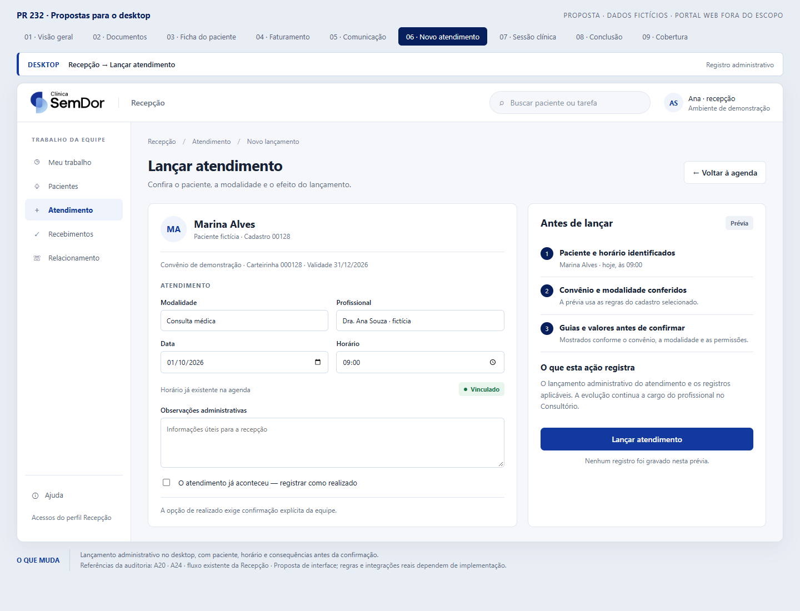
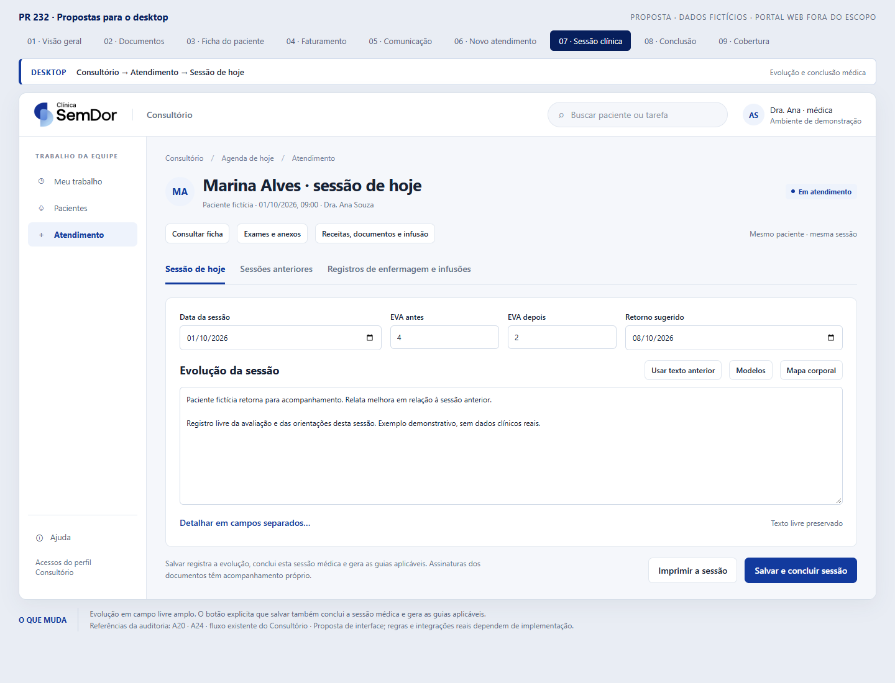
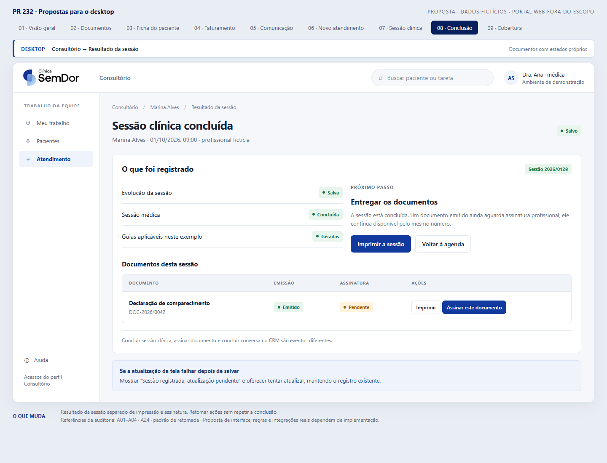

# Escopo aprovado e propostas visuais da PR 232

## Regra obrigatória: não alterar o portal web

**Decisão do proprietário em 01/10/2026: NÃO ENCOSTAR NO PORTAL WEB. A cliente está satisfeita com a experiência atual.**

O portal web está fora do escopo de implementação e de reorganização desta rodada. Preservar suas telas, navegação, filas, evolução de enfermagem, consentimentos, coleta de assinaturas, permissões e comportamento. Não publicar alterações no portal como consequência desta proposta.

A proposta visual **“Evolução e termos no mesmo atendimento” foi retirada**. Não juntar evolução e consentimentos no portal, nem usar a imagem anterior como referência de implementação.

Esta restrição também vale para mudanças indiretas: componentes, serviços ou contratos compartilhados não podem alterar a experiência ou o comportamento do portal. Uma mudança desktop que afete o portal deve ser separada ou adiada. Ampliar esse escopo depende de uma nova instrução explícita do proprietário.

Os achados históricos sobre portais continuam no inventário para rastreabilidade. Sua existência, prioridade ou inclusão em uma etapa antiga **não autoriza executá-los**. Esta decisão prevalece sobre recomendações anteriores da auditoria. Nas jornadas que cruzam desktop e portal, considerar apenas o trecho desktop que preserve integralmente o portal.

O CRM web é um produto separado dos portais. Não está redesenhado nesta apresentação; a distinção não autoriza modificá-lo automaticamente.

## Por que faltavam telas

A primeira apresentação mostrou somente seis exemplos de fluxos. Essa seleção foi insuficiente para representar a rotina e deixou Atendimento de fora. Não significava remoção das demais funções nem cobertura integral da PR.

A auditoria tem 70 achados e 263 arquivos de interface, incluindo componentes e estilos; esses números não equivalem a telas independentes. A versão atual tem **oito exemplos de desktop e um mapa explícito de cobertura**. As áreas ainda sem desenho estão identificadas abaixo.

## Atendimento: onde fica e como funciona

1. **Desktop · Recepção → Lançar atendimento:** paciente, convênio, modalidade e horário identificados; efeitos do lançamento antes de confirmar; “já aconteceu” exige seleção explícita. É um registro administrativo.
2. **Desktop · Consultório → Atendimento:** evolução em campo livre amplo; data, EVA e retorno; consulta de ficha, exames, documentos e histórico mantendo o paciente e o texto em edição. Detalhes em campos separados continuam secundários.
3. **Desktop · Consultório → Resultado da sessão:** mostrar o que foi salvo e o próximo passo. A proposta chama a ação de **“Salvar e concluir sessão”** porque o fluxo médico existente já salva a evolução, conclui a sessão e gera as guias aplicáveis. Não é uma nova regra clínica.

Impressão e assinatura de documentos têm estados próprios. Retomar um documento emitido não deve repetir sua emissão; uma falha ao atualizar a tela depois de salvar não deve repetir a conclusão da sessão.

A aba de registros de enfermagem e infusões no **Consultório desktop** consulta dados já disponíveis. Ela não é uma proposta de mudança do portal.

Fontes conferidas nesta revisão:

- [AtendimentoView.xaml](../../src/Clinica.Modulo.Clinico/Views/AtendimentoView.xaml): ação e explicação de Salvar sessão; ficha, histórico e registros de enfermagem.
- [FolhaDaSessaoView.xaml](../../src/Clinica.Desktop.Shell/Componentes/FolhaDaSessaoView.xaml): campo livre, EVA, retorno e detalhes secundários.
- [NovoAtendimentoView.xaml](../../src/Clinica.Modulo.Recepcao/Views/NovoAtendimentoView.xaml): formulário administrativo, consequências e opção explícita de realizado.

## Imagens e cobertura

O [protótipo interativo](propostas-visuais/index.html) deve ser aberto localmente no navegador, com os arquivos vizinhos preservados. O GitHub oferece o código HTML, não executa a demonstração. Todas as telas usam dados fictícios e são propostas, não capturas de funcionalidades já implementadas.

| Área | Onde muda | Imagem / situação |
| --- | --- | --- |
| Visão geral e organização | Desktop · Gerente | [Ver proposta](propostas-visuais/geral.png) |
| Emissão, impressão e assinatura | Desktop · Consultório / componentes conforme permissão | [Ver proposta](propostas-visuais/documentos.png) |
| Ficha do paciente e acesso ao recibo | Desktop · Recepção / módulo clínico | [Ver proposta](propostas-visuais/paciente.png) |
| Retornos TISS e XML | Desktop · Faturamento | [Ver proposta](propostas-visuais/faturamento.png) |
| Campanhas e confirmação de envio | Desktop · Gerente | [Ver proposta](propostas-visuais/comunicacao.png) |
| Lançamento do atendimento | Desktop · Recepção | [Ver proposta](propostas-visuais/novoatendimento.png) |
| Sessão e evolução médica | Desktop · Consultório | [Ver proposta](propostas-visuais/atendimento.png) |
| Resultado da sessão | Desktop · Consultório | [Ver proposta](propostas-visuais/conclusao.png) |
| Agenda, autorizações e busca completa | Desktop | Ainda sem desenho detalhado |
| Caixa, contas, conciliação e repasses | Desktop · Financeiro | Ainda sem desenho detalhado |
| Estoque, compras, cadastros e indicadores | Desktop · Gestão | Ainda sem desenho detalhado |
| Conversas, tarefas, funil e operação | CRM web | Ainda sem desenho detalhado |
| Evolução, consentimentos, filas e navegação | Portal web | **Excluído: preservar como está** |

[Mapa visual da cobertura](propostas-visuais/cobertura.png). Esta tabela agrupa áreas; o inventário completo continua em [Revisão por superfície](REVISAO-POR-SUPERFICIE.md).

### Desktop · Recepção

### Desktop · Consultório

### Desktop · Resultado da sessão

## Revisão e limite da entrega

Jev revisou por API as descrições do escopo, Recepção, Consultório e resultado, classificando as quatro como coerentes. [Pedido](propostas-visuais/jev-pedido-desktop.json) e [resposta sanitizada](propostas-visuais/jev-revisao-desktop.json) estão preservados. Essa foi uma revisão textual estruturada, não inspeção das imagens nem teste do produto.

As imagens foram renderizadas no navegador. A verificação do protótipo inclui troca de abas e abertura de contexto conservando o texto da evolução, além da navegação para o resultado. Não houve gravação clínica, assinatura real, implantação ou alteração de código do portal. A PR continua uma entrega de documentação e proposta visual.
