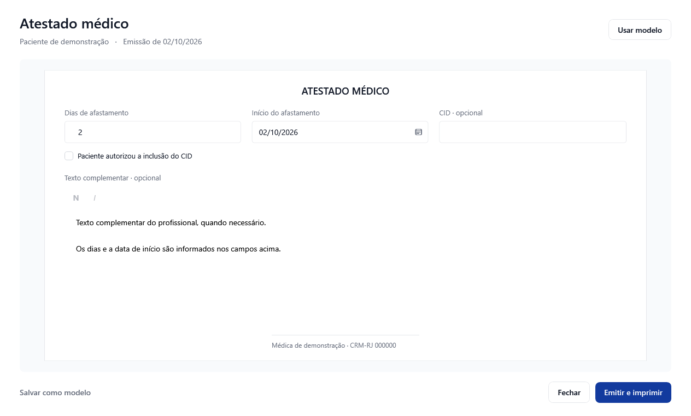
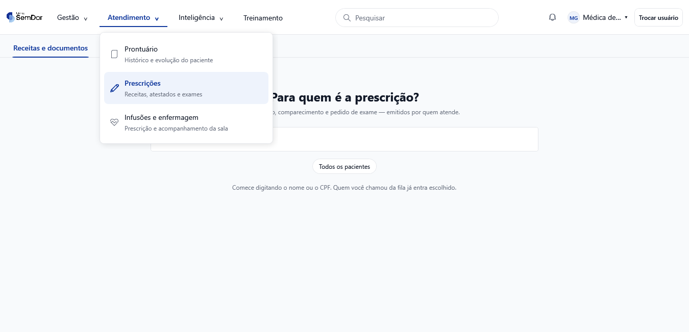
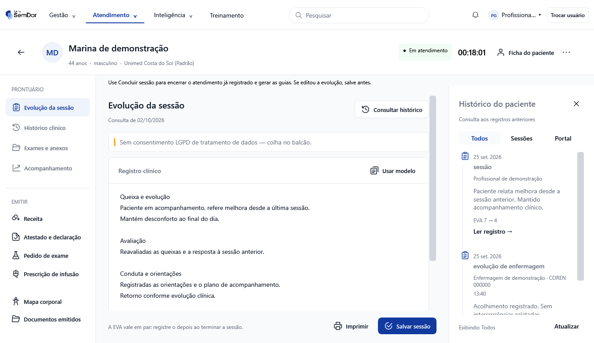

# Padrão visual aprovado do desktop

Referência consolidada em 03/10/2026 a partir das [PRs 235](https://github.com/lucaszaous-creator/Clinica/pull/235) e [237](https://github.com/lucaszaous-creator/Clinica/pull/237), das escolhas da direção e das telas implementadas.

**Direção visual: conteúdo amplo, superfícies claras, azul da marca nas ações principais e ícones discretos de traço uniforme.** A composição deve facilitar a tarefa: escrever, consultar e emitir precisam ter lugares claros na tela.

Use este documento antes de propor ou reformular telas desktop. Para documentos, barra superior e atendimento, ele substitui as orientações visuais antigas que entrarem em conflito. Regras de domínio, permissões e acessibilidade continuam valendo. O portal tem escopo próprio; estas aprovações não autorizam reformulá-lo.

## 1. O que aprendemos sobre a preferência da direção

| Evidência da conversa | Regra para a próxima proposta |
|---|---|
| Rejeitou propostas muito semelhantes à tela antiga e pediu uma melhoria maior. | Rever organização, área de trabalho e posição das ações; trocar cores e bordas é insuficiente. |
| Pediu modelos com a tela real do sistema. | Apresentar a composição no contexto do shell, com campos, rótulos e ações que o sistema realmente oferece. Usar dados fictícios. |
| Aprovou o modelo B para documentos e a barra com abas sublinhadas. | Reutilizar a folha central e a navegação superior descritas abaixo. |
| Aprovou o atendimento após referências de concorrentes adaptadas ao nosso design. | Usar referências para resolver o fluxo, preservando marca, linguagem e componentes da clínica. |
| Pediu melhorar os emojis e exigiu ícones idênticos aos apresentados. | Usar os mesmos desenhos aprovados, com tamanho e traço consistentes. Emoji não substitui ícone de interface. |
| Exigiu implementação fiel à foto, inclusive admitindo outra linguagem se necessário. | Tratar a imagem aprovada como referência de entrega. As duas PRs foram implementadas em WPF; a exigência é fidelidade visual, sem impor troca de tecnologia. |
| Pediu atualizar a barra nos demais módulos. | Tratar a navegação compartilhada como parte da suíte e verificar os aplicativos que a consomem. |

**Síntese inferida:** a direção prefere interfaces sóbrias, com bastante área útil, hierarquia visível e poucos elementos competindo pela atenção. Essa síntese orienta novas propostas; não significa que um layout ainda não apresentado já esteja aprovado.

## 2. Três composições de referência

### Documentos — modelo B, PR 235

- Cabeçalho com título, paciente e contexto da emissão; “Usar modelo” à direita.
- Folha branca central sobre fundo claro, com borda fina e espaço para escrever.
- Campos específicos de cada documento na própria folha. Dados adicionais e gerenciamento de modelos ficam na janela de opções.
- Editor com formatação simples, incluindo negrito e itálico; identificação do profissional ao final.
- Rodapé externo à folha: “Salvar como modelo” discreto à esquerda; “Fechar” e a ação principal “Emitir e imprimir” à direita.
- Mesma estrutura para receita, atestado, comparecimento e pedido de exame, preservando as diferenças funcionais.

| Documento | Conteúdo próprio dentro da estrutura comum |
|---|---|
| Receita | Texto da prescrição e formatação |
| Atestado | Dias, início do afastamento, CID opcional e autorização para incluí-lo |
| Comparecimento | Data, chegada e saída, com indicação quando os horários são herdados |
| Pedido de exame | Itens de exame, quantidade e indicação |

Outras referências reais: [receita](../capturas/documentos-modelo-b/Receita.png), [comparecimento](../capturas/documentos-modelo-b/Comparecimento.png) e [pedido de exame](../capturas/documentos-modelo-b/PedidoExame.png).

### Navegação superior — modelo B, PR 235

- Categorias na barra branca; categoria ativa com texto azul e sublinhado de 2 unidades.
- Menu suspenso branco, cantos suaves, sombra leve e itens com ícone, nome e descrição curta.
- Item ativo com fundo azul suave; estados de foco, hover e desabilitado continuam distinguíveis.
- Busca, identificação do usuário, permissões e destinos de navegação permanecem integrados.
- Em largura menor, reorganizar a barra preservando os acessos. Evitar o menu cinza com relevo do Windows antigo.

### Atendimento — modelo E com ícones revisados, PR 237

- Cabeçalho persistente com identidade do paciente, contexto e situação real da sessão.
- Navegação local à esquerda, separada em “PRONTUÁRIO” e “EMITIR”. A barra superior continua sendo a navegação entre áreas da suíte.
- Evolução como área principal: editor largo, folha branca, modelo reutilizável e informações da sessão próximas ao registro.
- Campos adicionais recolhíveis; alertas clínicos e erros continuam visíveis quando aplicáveis.
- Rodapé com “Imprimir” discreto e “Salvar sessão” como ação principal. Salvar e concluir a sessão mantêm seus significados próprios.
- Histórico contextual à direita quando há espaço; sobreposto à área de edição quando a largura é menor. Consultar e fechar o histórico preserva o rascunho.
- Histórico com data, autoria, tipo do registro e filtros “Todos”, “Sessões” e “Portal”.

[Veja o histórico sobreposto em janela compacta](../capturas/atendimento-modelo-e/compacto-historico-medico.png). As capturas mostram a implementação WPF; textos e dados de demonstração não são conteúdo obrigatório das próximas telas.

## 3. Aparência e medidas

Usar os recursos compartilhados de [Tokens.xaml](../../src/Clinica.Desktop.Shell/Styles/Tokens.xaml). Medidas WPF abaixo são unidades independentes de dispositivo (DIPs); a escala do Windows altera a quantidade de pixels físicos.

| Elemento | Referência |
|---|---|
| Ação principal | `Brush.Acento`, `#123A9E`; hover `#0A2E86` |
| Seleção | `Brush.Acento.Suave`, `#EEF3FC` |
| Fundo / superfície / borda | `#F8FAFC` / branco / `#E5E7EB` |
| Texto principal / secundário | `#111827` / `#6B7280` |
| Hierarquia tipográfica | Títulos 24/20/18; corpo 14; rótulos 13; apoio 12; título do compositor de documentos 26 |
| Espaçamento base | 4, 8, 12, 16, 24, 32, 40, 48 e 64; preservar as medidas específicas da composição aprovada |
| Superfícies | Bordas finas; raio 8 na folha do atendimento e no menu superior; sombra discreta no popup |
| Botões | Uma ação principal por área de trabalho; secundários com menor destaque; ícone com rótulo nas ações clínicas |
| Cores semânticas | Preservar sucesso, aviso, erro e informação; azul não substitui indicação de risco ou estado clínico |

Medidas concretas para reproduzir as telas existentes:

| Componente | Medidas implementadas |
|---|---|
| Documento | Margem externa 36,24; campos com altura 40; botões com altura mínima 38 |
| Folha do documento | Área externa com padding 45,20; folha com padding 36,24,36,20; abaixo de 900 de largura do componente, paddings reduzidos para 16 e 20 |
| Menu superior | Largura 340; raio 8; padding 8; lista com altura máxima 480 |
| Atendimento | Navegação local com largura 218; margem da área de edição 28,22,28,20 |
| Histórico | Largura lateral 330; sobreposição quando `AtendimentoView.ActualWidth < 1050` — a medida é da área da view, não da janela inteira |
| Editor da evolução | Altura mínima 160 e máxima 480; conteúdo da página pode crescer e rolar, mantendo o rodapé de ações fora da rolagem |

Esses valores descrevem os componentes aprovados. Uma tabela financeira ou agenda deve usar o mesmo vocabulário visual, com uma composição adequada à sua tarefa; não precisa virar uma folha de documento.

## 4. Ícones: reutilizar o desenho aprovado

Há duas referências aprovadas nas PRs, com implementações distintas:

| Contexto | Fonte e regra |
|---|---|
| Menu superior | `Segoe MDL2 Assets`, tamanho 16. Prontuário `E8A5`, Prescrições `E70F`, Infusões e enfermagem `E95E`, conforme `ItemMenuModulo.GlifoMenu` |
| Atendimento | `IconeClinico`: geometria em grade 24, exibida em 20, traço 1,8 com pontas e junções arredondadas; `more` usa traço 3 |
| Botão clínico | `BotaoClinico`: ícone com espaço de 8 antes do rótulo e altura mínima de 38 |

Catálogo clínico existente: `record`, `rx`, `infusion`, `history`, `folder`, `exam`, `patient`, `chart`, `document`, `back`, `save`, `print`, `close`, `model`, `body`, `more` e `check`.

Reutilizar [IconeClinico.cs](../../src/Clinica.Desktop.Shell/Componentes/IconeClinico.cs) e [ItemMenuModulo.cs](../../src/Clinica.Desktop.Shell/Modulos/ItemMenuModulo.cs). Não trocar um ícone por outro “parecido” após aprovação. Para ações novas, manter a família visual do contexto e apresentar o desenho na proposta. Botões só com ícone precisam de descrição acessível e tooltip.

## 5. Decisões funcionais que acompanham este design

- **Desktop:** a reformulação não inclui alterações no portal.
- **Enfermagem:** o prontuário do médico/gerente oculta e desabilita a aba de escrita da enfermagem. Os registros anteriores continuam disponíveis para consulta; a enfermagem registra pelo portal.
- **Documentos sem solicitação do SafeID:** receita, atestado, comparecimento, pedido de exame, relatório de evolução e anamnese seguem o fluxo desktop sem solicitar certificado. Preservar os arquivos históricos assinados e as regras próprias de entrega. A via emitida para impressão não deve ser apresentada como assinatura digital.
- **Contexto:** ações de emissão devem abrir o tipo correto e manter paciente, profissional e atendimento vinculados. Navegar para documentos emitidos deve selecionar a seção correta sem perder a evolução.
- **Permissões:** reorganizar controles não cria novos acessos. Validar também teclado e navegação programática quando uma aba estiver indisponível.

Fontes: [AcoesDoDocumento.cs](../../src/Clinica.Desktop.Shell/Componentes/AcoesDoDocumento.cs), [PacienteWorkspaceView.xaml](../../src/Clinica.Modulo.Clinico/Views/PacienteWorkspaceView.xaml) e seu [ViewModel](../../src/Clinica.Modulo.Clinico/ViewModels/PacienteWorkspaceViewModel.cs).

## 6. Como aplicar e demonstrar fidelidade

1. **Escolher a referência:** documento B, barra B ou atendimento E. Para um fluxo diferente, explicar a adaptação na proposta.
2. **Mostrar a tela no contexto real:** shell, conteúdo plausível, ações disponíveis e ícones finais. Identificar claramente se é proposta ou captura da implementação.
3. **Comparar a implementação com a referência aprovada:** estrutura, proporções, tipografia, cores, espaços, ícones e posição das ações. Usar o mesmo tamanho de janela e registrar a escala.
4. **Exercitar o fluxo:** abrir, preencher, salvar, emitir/imprimir e consultar conforme a tela. Incluir estados vazio, carregando, erro e recuperação quando existirem; preservar o rascunho.
5. **Conferir limites de layout:** janela ampla e compacta, textos longos, campos expandidos, navegação por teclado e escala de exibição. No atendimento, verificar o foco no histórico, Escape e retorno ao editor.
6. **Validar a suíte afetada:** se o shell mudou, verificar os módulos consumidores. Quando houver publicação autorizada, planejar os releases dos módulos afetados para que a barra seja distribuída de forma consistente.

Referências já exercitadas: barra em larguras 1366/1280/1024/880; documentos 1280/900; atendimento 1366×820 e 1100×760, histórico aberto/fechado e escala simulada 125%/150%. Simulação de escala deve ser identificada como tal; não comprova teste físico em monitores com DPI diferente.

Ferramentas existentes: [VerificarDocumentos](../../tools/VerificarDocumentos/Program.cs), [ValidarAtendimentoDesktop](../../tools/ValidarAtendimentoDesktop/Program.cs) e seus [cenários adicionais](../../tools/ValidarAtendimentoDesktop/CenariosAdicionais.cs). Compilação e testes funcionais complementam a comparação visual. Uma nota de confiança de auditoria isolada não comprova fidelidade da tela.

**Checklist para a entrega:**

- [ ] A tarefa principal tem espaço e uma ação principal facilmente reconhecível.
- [ ] Layout e ícones correspondem à referência aprovada; diferenças estão explicadas.
- [ ] A tela compacta mantém campos, ações e navegação utilizáveis.
- [ ] Rascunho, contexto do paciente, permissões e alertas foram preservados.
- [ ] Há capturas da aplicação real com dados fictícios e evidência dos fluxos afetados.
- [ ] O escopo desktop/portal e os módulos afetados estão explícitos.

## 7. Onde implementar

| Parte | Fonte compartilhada ou tela |
|---|---|
| Folha de documentos | [DocumentoFolha.cs](../../src/Clinica.Desktop.Shell/Componentes/DocumentoFolha.cs) |
| Navegação superior | [NavegacaoSuperior.xaml](../../src/Clinica.Desktop.Shell/Styles/Componentes/NavegacaoSuperior.xaml) e [ShellWindow.xaml](../../src/Clinica.Desktop.Shell/Shell/ShellWindow.xaml) |
| Cabeçalho e navegação do paciente | [PacienteWorkspaceView.xaml](../../src/Clinica.Modulo.Clinico/Views/PacienteWorkspaceView.xaml) |
| Evolução e rodapé | [AtendimentoView.xaml](../../src/Clinica.Modulo.Clinico/Views/AtendimentoView.xaml) |
| Histórico contextual | [HistoricoConsultaView.xaml](../../src/Clinica.Modulo.Clinico/Views/HistoricoConsultaView.xaml) |

Reutilizar os componentes e tokens existentes antes de criar outra variante. Uma nova aprovação visual deve atualizar esta referência e suas capturas, mantendo a origem da decisão.
