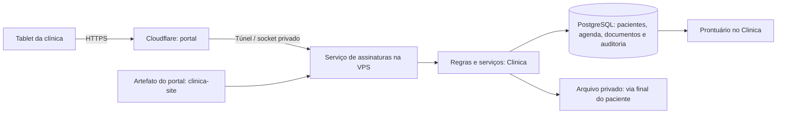

# Plano — assinatura presencial de BSV e TCLE no tablet

## 1. Objetivo e decisões recebidas

A enfermeira acessa a lista de pacientes/agendamentos do dia, seleciona o paciente,
confere a identidade e entrega o tablet. O paciente lê os termos, responde às
declarações e faz sua rubrica diretamente na tela, com o dedo ou uma caneta.
O prontuário passa a mostrar o evento e a via assinada.

**Somente o paciente assina**, conforme confirmação do solicitante. A enfermeira
fica identificada como operadora da coleta; seu registro não será apresentado como
assinatura do termo. Não haverá etapa obrigatória de assinatura do médico neste fluxo.

**Vínculo obrigatório:** rubrica e evidências da assinatura → documento e versão
exatos → prontuário do paciente. O vínculo com sessão clínica ou agendamento é
opcional. A agenda facilita a seleção do paciente, mas não é requisito para
assinar, arquivar ou recuperar o documento.

**Alergias são uma resposta obrigatória:** nenhuma opção vem marcada. Enquanto
o paciente não responder, não consegue rubricar nem enviar o termo. O servidor
também recusa a submissão sem essa resposta. Uma resposta positiva é preservada
e sinalizada à equipe para avaliação; não equivale a uma pergunta sem resposta.

Este é um plano, não uma implementação. Foram revisados o código e os documentos dos
dois repositórios; não foram consultados pacientes, banco ou arquivos clínicos de
produção, nem alterados serviços da VPS.

## 2. O que já existe e deve ser aproveitado

Base de código examinada: `Clinica`, commit
`61d5cd43fd2dcf32eb45962f69048ae99a16790f`. O `clinica-site` permanece o institucional
estático, com seu Nginx isolado e a hospedagem documentada no README.

| Recurso existente no Clinica | Aproveitamento e cuidado |
| --- | --- |
| `ModelosTermoBsv` | Já contém TCLE e termo da sessão de Bloqueio Simpático Venoso. Preservar o texto vigente da clínica; não redigir conteúdo médico novo nesta entrega. |
| `AgendaService` e `TermoProcedimentoService` | Fornecem agenda e situação dos termos. Criar uma consulta reduzida para a enfermagem, sem expor ficha completa nem dados financeiros. |
| `DocumentoClinico` | Já tem paciente obrigatório, modelo de origem, agendamento e evolução opcionais, texto copiado e situação de assinatura. |
| `AssinaturaDoPacienteService` | Já registra traço, respostas, identidade conferida, operadora, horário, selo do conteúdo, recusa e auditoria. Precisa de uma fronteira web com autorização, concorrência e finalização durável. |
| `DocumentosClinicosPdfService` | Já gera o PDF com o traço. Na ausência do arquivo da assinatura profissional, pode regenerá-lo: falta assegurar uma via final imutável para a assinatura exclusiva do paciente. |
| Permissão `ColherAssinaturaPaciente` | Aproveitar a permissão específica, junto da autorização de agenda; não conceder acesso integral ao prontuário para conseguir coletar um termo. |
| `ColetaRemotaTermoService` | O fluxo por WhatsApp já tem conceitos úteis, mas depende de objetos intermediários e conferência posterior no desktop. O novo fluxo presencial deve concluir no servidor, sem depender de uma janela desktop aberta. |
| `Clinica.Web` | Existe uma aplicação de leitura para funcionários. Seus cookies e permissões em fotografia não são suficientes para a nova operação de assinatura; não expor seus endpoints internos diretamente ao paciente. |

Evidências no código:

- [Modelos e regras dos dois termos](https://github.com/lucaszaous-creator/Clinica/blob/61d5cd43fd2dcf32eb45962f69048ae99a16790f/src/Clinica.Application/Servicos/ModelosTermoBsv.cs)
- [Coleta da assinatura do paciente](https://github.com/lucaszaous-creator/Clinica/blob/61d5cd43fd2dcf32eb45962f69048ae99a16790f/src/Clinica.Application/Servicos/AssinaturaDoPacienteService.cs)
- [Geração/recuperação do PDF](https://github.com/lucaszaous-creator/Clinica/blob/61d5cd43fd2dcf32eb45962f69048ae99a16790f/src/Clinica.Application/Servicos/DocumentosClinicosPdfService.cs#L146)
- [Cobertura por dia e vínculo com o horário](https://github.com/lucaszaous-creator/Clinica/blob/61d5cd43fd2dcf32eb45962f69048ae99a16790f/src/Clinica.Application/Servicos/TermoProcedimentoService.cs#L341)

## 3. Fluxo recomendado no atendimento

### A. Painel da enfermagem

1. A enfermeira entra com sua própria conta. Sessão revogável e dispositivo da
   clínica autorizado; reforçar a autenticação para acesso pela internet.
2. A tela abre o dia da clínica, no fuso `America/Sao_Paulo`. Mostra horário,
   identificação suficiente do paciente, procedimento e situação de cada termo.
3. Cancelamentos e faltas são tratados segundo a agenda. Dois horários do mesmo
   paciente aparecem de forma distinguível, com os termos consultados no prontuário
   do paciente. Não criar duas coletas automaticamente por haver dois horários.
4. A enfermeira seleciona o paciente e confere dois identificadores, como nome e
   data de nascimento, além do documento conforme o procedimento da clínica.
   A seleção pela agenda não torna obrigatório associar o termo àquele horário.
   Prever também seleção autorizada de paciente sem agendamento, com dados mínimos.
5. O servidor resolve os documentos exigidos e sua versão. A operadora confirma
   os termos antes de tocar em **Entregar tablet ao paciente**.

### B. Modo paciente

6. O servidor bloqueia a sessão operacional antes da entrega. O tablet passa a
   ter acesso somente à coleta daquele paciente e daqueles documentos.
7. O paciente vê a própria identificação, o procedimento e um termo por vez.
   Texto legível, ampliação, boa área de toque e opção de chamar a enfermeira.
8. As declarações vêm sem respostas preselecionadas. O paciente pode responder,
   apontar divergência, pedir esclarecimento ou recusar. Rolagem até o fim não será
   tratada como prova de compreensão ou consentimento. A pergunta sobre alergias
   precisa de resposta explícita: enquanto estiver vazia, a área de rubrica e o
   envio ficam bloqueados, com indicação clara do que falta responder.
9. Há uma rubrica própria e confirmação explícita por documento. O paciente
   desenha o traço na tela com dedo ou caneta e pode limpar/refazer antes de confirmar.
   A rubrica fica incorporada à via final daquele termo. Não reaproveitar o traço
   de outro termo silenciosamente. Respostas alteradas após rubricar exigem nova
   confirmação e rubrica, para manter o vínculo com o conteúdo efetivamente aceito.
10. **Confirmar e assinar** envia uma submissão vinculada à coleta. O servidor
    verifica identidade vinculada, documento/versão, respostas, traço, validade e
    concorrência. O navegador não escolhe livremente `PacienteId` ou `DocumentoId`.
    Resposta sobre alergias ausente, nula ou vazia bloqueia também a API, mesmo
    que alguém tente contornar os controles da tela; não converter ausência em “não”.
11. A tela confirma a conclusão somente depois de a via final e o registro no
    prontuário estarem persistidos. Até lá, mostra **Finalizando documento**.

### C. Retorno à enfermagem e prontuário

12. Ao concluir, recusar ou encerrar, o tablet permanece em tela neutra. Voltar à
    lista exige reautenticação da enfermeira; não basta apertar um botão escondido.
13. No Clinica, o documento aparece no prontuário do paciente, com sua rubrica e
    via final. Agendamento e evolução são referências opcionais; não criar nenhum
    deles apenas para armazenar o termo. Ausência, remarcação ou cancelamento do
    agendamento não remove o documento nem impede recuperar a via assinada.
14. A equipe vê data/hora, operadora, documento e versão, respostas relevantes e
    ação **Abrir via assinada**. A via pode ser impressa ou disponibilizada ao
    paciente pelo canal aprovado da clínica, sem link público permanente nem
    download automático no tablet compartilhado.

## 4. Regra clínica: documento assinado não libera procedimento

O estado documental e a avaliação assistencial devem ser separados. Exemplo:
**Assinado — resposta requer avaliação da equipe**. Alergias, alterações de saúde
ou cuidados não cumpridos não desaparecem porque houve assinatura. A equipe deve
ver as respostas, avaliá-las e registrar sua decisão no fluxo clínico existente.

Não juntar TCLE de procedimento com consentimento de marketing ou fazer a assinatura
servir como autorização genérica de tratamento de dados. Não alterar automaticamente
o cadastro de alergias a partir de uma declaração sem validação clínica e autoria.

**Validade precisa preservar a política existente:** o TCLE geral tem cobertura
continuada e o termo da sessão tem cobertura no dia. O código atual distingue
essa cobertura do vínculo documental com `AgendamentoId`, que permanece opcional.
“Termo da sessão” é o nome do modelo existente e sua regra de validade diária;
não impõe anexação a uma sessão específica. Registrar a procedência quando ela
for informada, sem exigir duas assinaturas por haver dois horários no mesmo dia.
Preservar a regra vigente; definir a recoleta após revisão do modelo antes do piloto.

Se o paciente não puder assinar pessoalmente, não registrar a enfermeira ou outra
pessoa como se fosse ele. O primeiro escopo contempla assinatura do próprio paciente;
representantes, incapacidade e testemunhas adicionais exigem fluxo específico.

## 5. Divisão entre os repositórios e arquitetura

**Proposta:** `portal.clinicasemdormacae.com.br`, como aplicação separada do
institucional. O nome é proposto, ainda não configurado.

| Repositório | Responsabilidade |
| --- | --- |
| `clinica-site` | Interface do portal em pasta/projeto próprio: painel da enfermagem, modo paciente, leitura, declarações, canvas de assinatura e recibo. Reaproveitar a marca, sem misturar o build do portal com `publico/` institucional. |
| `Clinica` | Serviço ASP.NET Core dedicado, sugerido `Clinica.Assinaturas.Api`: autenticação e sessões, autorização, agenda reduzida, regras dos termos, recepção/finalização, PDF, arquivo privado, auditoria e integração com o prontuário. |

Para reduzir componentes na VPS, o serviço ASP.NET pode servir o artefato da interface
do `clinica-site` e as rotas `/api` na mesma origem. Assim há **um novo processo
dinâmico**, sem necessidade de outra SPA pesada, servidor Node ou broker de mensagens.
O código de interface e o código clínico mantêm seus repositórios e contratos separados.

O serviço novo aproveita as camadas existentes, mas não publica `IClinicaRepositorio`
como API genérica. Sua credencial de execução deve ter somente as permissões
necessárias; migrations usam outra identidade. Não reutilizar a conexão administrativa
dos desktops nem entregar acesso ao banco para JavaScript ou Nginx do institucional.

O framework final será fixado na primeira etapa de compatibilidade: reaproveitar
ASP.NET Core e bibliotecas do Clinica, usando runtime suportado no lançamento.
Qualquer migração de framework ampla fica explícita, sem atualizar toda a suíte
como consequência de criar quatro telas.

## 6. Gravação confiável e a via assinada

### Dados a acrescentar ou consolidar

- **Sessão de coleta presencial:** paciente e documentos/versões obrigatórios;
  agendamento opcional; operadora, dispositivo autorizado, estado, expiração e
  revogação. Aqui “sessão de coleta” é o acesso temporário do tablet, não uma
  sessão clínica exigida para guardar o documento.
- **Submissão:** chave de idempotência, respostas, traço validado, conteúdo exato
  apresentado, identificação conferida, horário do servidor e vínculo da coleta.
- **Via final do paciente:** bytes imutáveis do PDF ou referência privada, hash,
  versão do gerador e relação com o documento clínico. Tipo próprio, sem marcar
  o documento como assinado por certificado de um profissional.
- **Trilha de eventos:** preparação, entrega, recebimento, arquivamento, recusa,
  expiração, cancelamento e acesso à via, com autoria e correlação.

O selo atual cobre texto e respostas, mas não todos os elementos de identidade e
proveniência. A nova evidência deve vincular também paciente, documento, versão,
operadora, rubrica e documento final, com formato canônico versionado. Agendamento
é metadado opcional de procedência, congelado como evidência quando informado;
alterações posteriores da agenda não reescrevem a evidência nem a via assinada.
Preservar a validação dos documentos antigos; não recalcular e substituir seus selos.

### Finalização

1. Persistir a submissão e uma tarefa durável de finalização em uma transação no banco.
2. Gerar o PDF usando o conteúdo congelado e as respostas realmente dadas. Identidade,
   texto, respostas, assinatura e comprovante de coleta devem formar a via.
3. Guardar o PDF em armazenamento privado e verificar o hash dos bytes guardados.
4. Vincular a via, finalizar o documento, registrar auditoria e consumir a coleta de
   forma transacional. Somente então publicar o estado **Assinado e arquivado**.
5. Se o arquivo for armazenado fora do banco, tratar a operação como etapas duráveis:
   uma falha entre storage e banco deixa tarefa retomável, não um falso sucesso.

Proposta de estado:

`Preparado → Em leitura → Recebido/finalizando → Assinado e arquivado`

Há saídas próprias para recusa, cancelamento e expiração. Uma submissão já recebida
não é descartada porque a sessão do tablet expirou. Um worker leve no próprio serviço
pode retomar tarefas pelo banco; não é necessário adicionar Redis/RabbitMQ ao piloto.

Clique duplo, reenvio e dois tablets disputando o mesmo documento devem produzir um
único resultado, com transição atômica e restrições de unicidade no banco. O método
`ColherAsync` atual salva internamente: a implementação precisa compor ou refatorar
essa fronteira para não marcar como concluído antes da via estar disponível.

Ao abrir depois, entregar os mesmos bytes arquivados. Alterar marca, endereço,
modelo ou biblioteca PDF no futuro não pode reescrever a via assinada. Correções
geram novo documento com motivo e referência ao anterior, preservando o histórico.
Hash auxilia a integridade, mas sozinho não prova autoria nem impede um administrador
de alterar banco e arquivo; aplicar permissões, auditoria e cópias externas protegidas.

## 7. Segurança do tablet e dos documentos

- **Bloqueio no servidor durante a entrega:** toda rota de enfermagem, inclusive
  URL direta e outras abas da sessão, deve ser recusada. A sessão restrita só
  permite aquela coleta. Esconder menu não é controle de acesso.
- **Tablet administrado:** modo de aplicativo único/uso guiado e navegador exclusivo
  para esse fluxo. Reautenticação para voltar à enfermagem, limpeza da tela e estado
  após cada paciente. Testar histórico e restauração de abas; cache headers não
  garantem apagar toda memória ou capturas feitas pelo sistema operacional.
- Cookies exclusivos `Secure`/`HttpOnly`, proteção CSRF, sessão revogável e checagem
  de permissões a cada operação. Expiração precisa dar tempo para ler o TCLE e aviso
  antes de encerrar; nunca retornar automaticamente à lista de outros pacientes.
- Sem assinatura, nome, CPF ou conteúdo clínico em URL, logs de proxy ou analytics.
  Sem tokens em localStorage, armazenamento offline ou service worker com prontuários.
- PNG do traço validado no servidor por formato, tamanho, dimensões e conteúdo;
  não confiar apenas em quantidade de bytes para aceitar uma assinatura em branco.
  Rejeitar SVG/HTML e arquivos disfarçados. Redimensionar ou girar o tablet não apaga
  um traço em andamento sem aviso.
- APIs e PDFs privados com autorização por documento, `no-store`, `noindex`,
  `nosniff`, CSP própria e sem cache de CDN. JavaScript de assinatura é restrito ao
  portal; o institucional mantém sua política atual que bloqueia scripts.
- Identidade da enfermeira vem da autenticação, não de um nome informado no POST.
  Identidade do paciente é conferida presencialmente e vinculada no servidor;
  conhecimento de CPF não funciona como senha ou prova autônoma.
- Registrar a apresentação do termo e o aceite sem afirmar que um temporizador ou
  a rolagem provaram entendimento. Não coletar biometria comportamental do traço
  sem necessidade e definição específica de finalidade/proteção.

## 8. Assinatura e proteção de dados

A assinatura solicitada é a rubrica manuscrita capturada digitalmente na tela do
tablet. Tecnicamente, a proposta é assinatura eletrônica presencial com traço, aceite explícito,
conferência de identidade e evidências. Não será anunciada como assinatura
qualificada ICP-Brasil nem como assinatura digital do médico. Não há necessidade
técnica, no escopo solicitado, de obrigar o paciente a criar conta no portal ou
autenticar no gov.br para simplesmente usar o tablet acompanhado.

A MP 2.200-2, art. 10, §2º, admite outros meios de comprovação de autoria e integridade
quando aceitos pelas partes. Isso não torna qualquer imagem colada em um PDF uma
prova suficiente: confirmar com a direção e o jurídico a adequação do procedimento,
do texto e do conjunto de evidências antes do piloto com pacientes reais.
[Texto oficial](https://www.planalto.gov.br/ccivil_03/mpv/antigas_2001/2200-2.htm).

Dados de saúde exigem proteção e controle de acesso segundo a LGPD. O TCLE do
procedimento não deve ser confundido com a base legal de todo tratamento de dados.
Definir retenção dos documentos e auditoria conforme a política de prontuário e
obrigações aplicáveis; não apagar termo assinado quando o link ou a sessão expirar.
[LGPD](https://www.planalto.gov.br/ccivil_03/_ato2015-2018/2018/lei/l13709.htm),
[Lei 13.787/2018](https://www.planalto.gov.br/ccivil_03/_ato2015-2018/2018/lei/l13787.htm).

## 9. Implantação na mesma VPS

- Manter o institucional no contêiner sem rede já existente. Criar serviço e
  diretórios próprios para o portal/API, com usuário, credencial e limites próprios.
- Entrada pelo Cloudflare Tunnel em socket Unix ou listener somente local. Nenhuma
  nova porta pública de banco ou aplicação. Acesso do novo serviço ao PostgreSQL
  pelo canal privado autorizado, com credenciais/certificados exclusivos.
- Confirmar HTTPS válido no subdomínio antes de qualquer coleta. Não usar pacientes
  reais em prévia pública, HTTP ou ambiente sem autorização por sessão.
- A VPS tem capacidade limitada; medir memória, CPU, espaço e latência do atendimento
  antes de reservar recursos. Começar com uma geração de PDF por vez, pool de banco
  pequeno e limite de concorrência. O piloto deve provar que o Clinica não piora.
- Reaproveitar a abstração de armazenamento privado, verificando a configuração real.
  Escolher banco versus storage privado na etapa inicial com volume estimado e
  retenção; não aumentar indefinidamente o banco ou o disco de 60 GB por conveniência.
- Incluir PDFs, metadados, versões e trilha em backup com recuperação testada e cópia
  protegida fora da VPS. Uma única máquina não fornece alta disponibilidade; prever
  contingência assistida em papel, com anexação posterior identificada como tal.
- Migrations aditivas, compatibilidade com os desktops existentes, feature flag e
  rollback da aplicação sem apagar documentos. Manifesto de release deve fixar SHA
  do frontend, SHA do backend e versão do schema/contrato.

## 10. Etapas e critérios de entrega

| Etapa | Entrega verificável |
| --- | --- |
| 1. Contrato e protótipo | Quatro telas com pacientes fictícios; modelos vigentes, regra de validade, vínculo opcional ao agendamento, trava de resposta sobre alergias e retomada da enfermeira definidos; capacidade/storage/runtime conferidos |
| 2. Caminho completo mínimo | Um paciente fictício, dois termos, resposta obrigatória sobre alergias, rubrica no tablet, PDF final guardado e abertura no prontuário mesmo sem agendamento; API/contratos nos dois repositórios |
| 3. Proteção e falhas | Bloqueio real do modo equipe, autorização, concorrência, recusa, expiração, falha de rede/arquivo e recuperação idempotente |
| 4. Homologação no tablet | Enfermagem usa o aparelho real da clínica; leitura, toque, rotação, texto ampliado e retorno ao painel; restauração e impacto na VPS conferidos |
| 5. Piloto | Acesso de equipe limitada, documentação operacional e acompanhamento dos resultados; expansão após aceite do fluxo |

Testes indispensáveis, focados no risco:

1. Paciente A não acessa lista, assinatura ou PDF de B, nem adulterando IDs, URL,
   métodos HTTP, histórico ou outra aba. Usuário sem permissão não prepara coleta.
2. Paciente e documento corretos, inclusive homônimos. Coleta e abertura da via
   funcionam sem agendamento ou evolução. Dois horários no dia não duplicam a
   exigência; cancelamento/remarcação não altera nem oculta o documento assinado.
3. TCLE vigente e termo diário respeitam a regra atual; revisão de modelo não
   altera o texto já apresentado nem os documentos anteriormente assinados.
4. Sem resposta sobre alergias, rubrica e envio ficam bloqueados. A API rejeita
   campo ausente, nulo ou vazio; não preenche “não” automaticamente. Respostas
   explícitas negativas e positivas são preservadas conforme o modelo; alergia
   informada fica sinalizada à equipe, sem liberar automaticamente o procedimento.
   Outras respostas obrigatórias em branco e traço vazio também são recusados.
   Limpar/refazer a rubrica funciona no tablet; cada via exibe o traço do próprio
   documento, e alteração das respostas exige nova confirmação e rubrica.
5. Duplo clique, duas sessões concorrentes e perda de resposta após o commit não
   duplicam documentos nem exigem refazer uma assinatura já recebida.
6. Queda antes/depois de gravar PDF, reinício do serviço e expiração durante a
   finalização não perdem a submissão e não mostram sucesso incompleto.
7. Via reaberta mantém o mesmo hash; alteração posterior do modelo/marca não muda
   os bytes; tentativa de sobrescrever ou excluir pela conta operacional falha.
8. Backup restaura o vínculo, a via e as evidências. Tablet real e carga esperada
   do piloto funcionam sem degradação relevante dos serviços clínicos.

Não executar milhares de cenários a cada ajuste. Primeiro estabilizar o caminho
completo mínimo; depois os casos críticos e uma matriz dirigida aos aparelhos
realmente usados. Configurar CI por componente afetado e evitar duplicação push/PR.
Documentação isolada não precisa disparar a bateria de navegador do institucional.

## 11. Limites do primeiro escopo

Incluído: coleta presencial dos dois termos, assinatura exclusiva do paciente,
rubrica diretamente no tablet, resposta obrigatória sobre alergias, painel da
enfermagem, via imutável e integração com o prontuário sem exigir agendamento.

Ficam para decisão separada: portal completo de exames/receitas, conta individual
de paciente, assinatura em casa por WhatsApp, biometria, assinatura de médico,
representantes legais e funcionamento offline. Nenhum serviço pago, provedor de
assinatura ou nova infraestrutura foi contratado neste planejamento.

**Critério final:** a enfermeira seleciona um paciente autorizado e os documentos;
o paciente lê, responde obrigatoriamente sobre alergias e rubrica cada termo no
tablet com privacidade. A via assinada fica recuperável no prontuário mesmo sem
vínculo com sessão clínica, com autoria, versão, integridade e resultado de gravação
comprovados.
