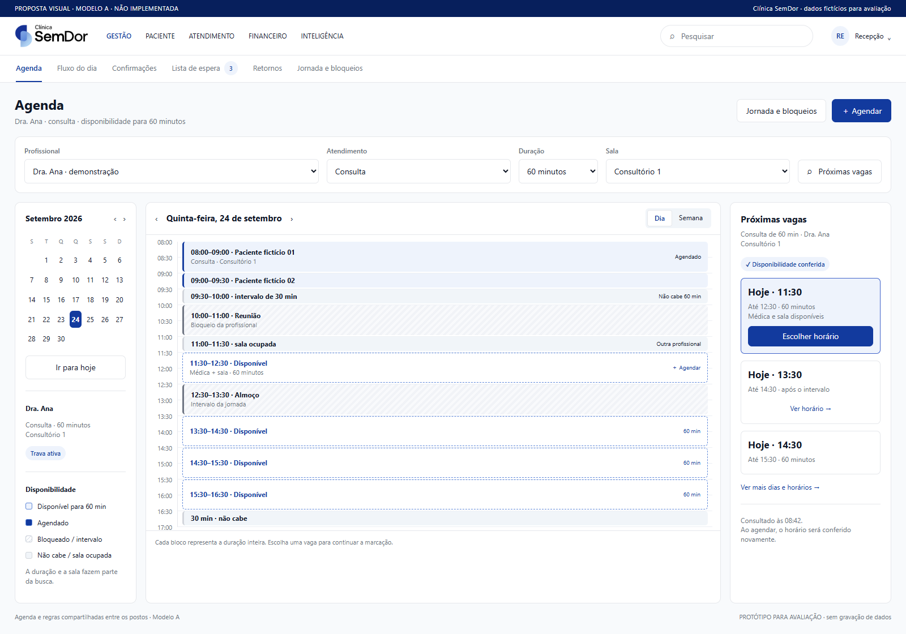
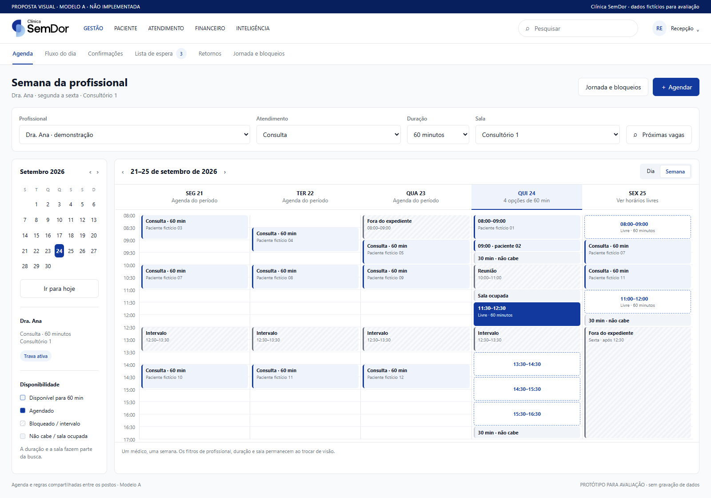
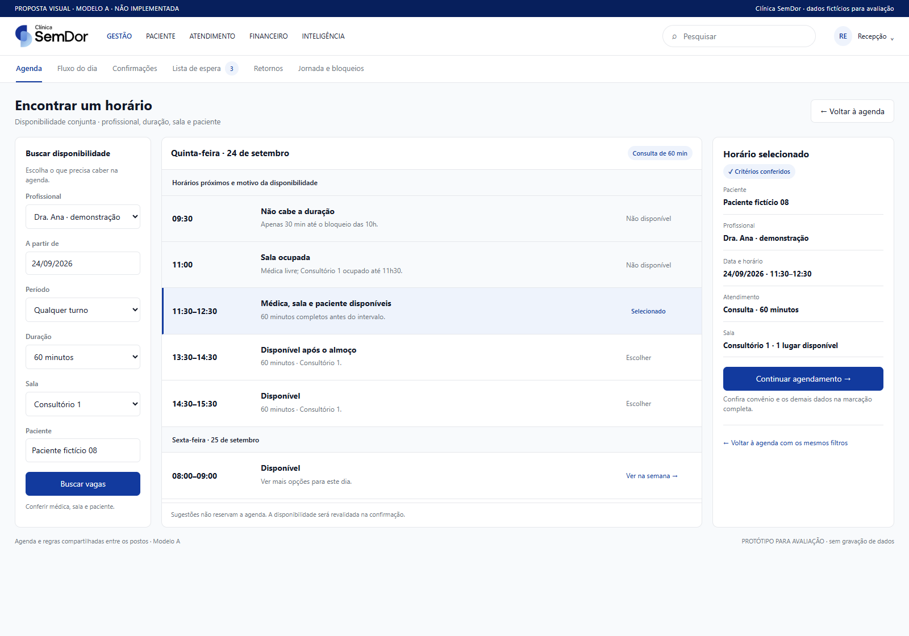
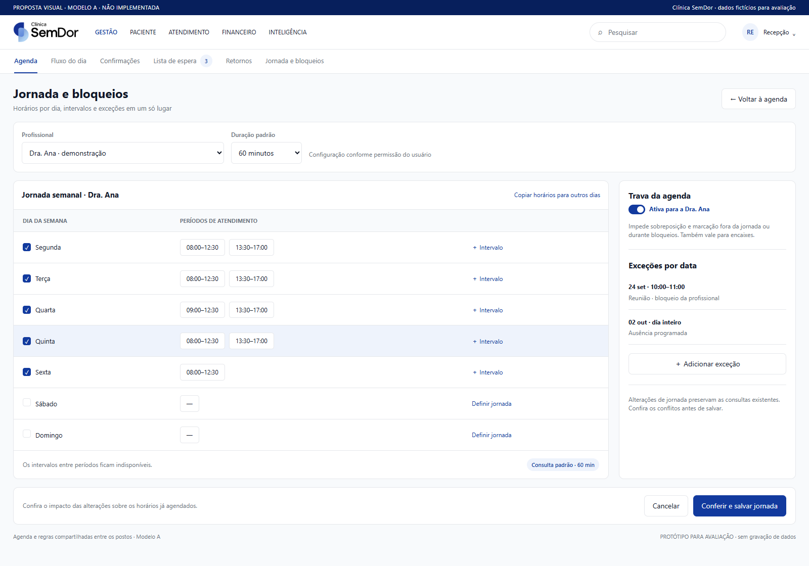
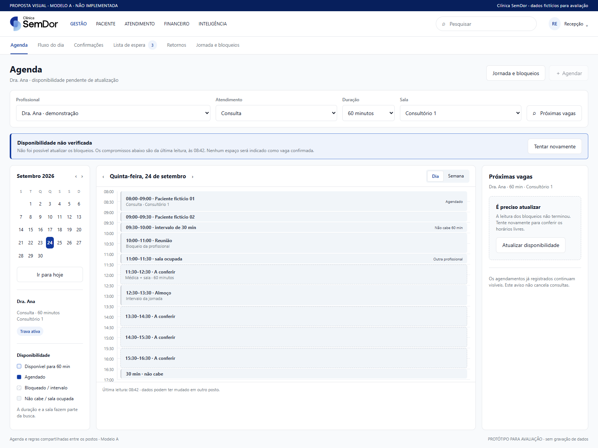

# Agenda — diagnóstico e recomendações com Jev

## Como propomos deixar — imagens das novas telas

**Cinco capturas de protótipos HTML renderizados no navegador, seguindo o Modelo A:** logo oficial, paleta do design system e tipografia Segoe UI. São propostas visuais, ainda não implementadas no aplicativo WPF nem publicadas em produção. A navegação do protótipo é parcial; os controles não consultam nem gravam no banco.

Todos os dados exibidos são fictícios. As oito capturas WPF da versão atual continuam na [galeria de evidências](README.md#capturas-reais-da-versão-atual). As imagens abaixo mostram concretamente como recomendamos organizar a agenda.

### Proposta 1. Agenda diária de cada médico

Profissional, duração e sala no mesmo cabeçalho; calendário para saltar de data; horários ocupados, bloqueados e disponíveis desenhados pela duração. No exemplo, a primeira vaga conjunta é 11h30–12h30.

[Comparar com a tela atual](fotos/02-grade-profissionais.png).

### Proposta 2. Semana completa do médico selecionado

O médico permanece selecionado ao trocar entre Dia e Semana. A jornada e os intervalos ficam visíveis; sexta-feira à tarde aparece fora do expediente.

[Comparar com a tela atual](fotos/03-grade-semana.png).

### Proposta 3. Encontrar uma vaga que realmente comporte a consulta

A busca considera profissional, sala, capacidade, paciente e duração. Mostra por que 09h30 não comporta 60 minutos e por que 11h conflita com a sala. Continuar leva ao agendamento completo.

[Comparar com a tela atual](fotos/07-proximas-vagas.png).

### Proposta 4. Jornada, intervalos, bloqueios e trava juntos

Configuração por dia da semana, mais de um intervalo de trabalho, exceções por data e estado da trava. A função Marcar permanece disponível pelo botão Agendar; a proposta preserva séries, encaixes e validações.

[Comparar com a tela atual](fotos/05-horarios-travas.png).

### Proposta 5. Falha de atualização com mensagem clara

Quando não for possível conferir os bloqueios, manter a última leitura identificada e pedir atualização. Não apresentar espaços vazios como vagas confirmadas. Este é um novo estado proposto, sem captura equivalente da versão atual.

## Origem e limites das imagens

As cinco imagens acima são capturas dos protótipos propostos. As oito imagens em `fotos/` são capturas dos componentes WPF reais da PR #205, commit `798dd26`, executados localmente com perfil Recepção e banco SQLite isolado. Não são imagens da produção. Todos os nomes e horários são fictícios. A execução das capturas WPF teve oito PNGs, nenhuma exceção e log de bindings vazio.

## Conclusão

A agenda pode melhorar principalmente na escolha do profissional, na leitura de disponibilidade e na consistência entre suas visões. A busca Próximas vagas já existe: a proposta é reutilizá-la e completar seus critérios. Jev (`jev-1.13.0`, consulta real TypeSafe) avaliou os trechos e recomendou priorizar filtro unificado, busca integrada, estado não verificado e jornada por dia. A conferência visual e as conclusões são apoiadas no código local.

## Exemplo reproduzido

No cenário fictício, Dra. Ana tem atendimento até 09h30 e bloqueio das 10h às 11h. Uma consulta de 60 minutos não cabe às 09h30; a busca retorna 11h. Porém, o Consultório 1 está ocupado por outra médica das 11h às 11h30. Portanto, 11h é livre para a profissional, mas precisa da conferência da sala antes de ser apresentado como vaga completa. O formulário atual possui conferência de conflitos; esta limitação se refere à busca e à comunicação de disponibilidade.

## Recomendações

### 01. Escolher o médico em qualquer visão

**Hoje:** O Dia filtra apenas profissionais com horários ativos. Grade e semana não oferecem um seletor equivalente para a recepção.

**Proposta:** Um seletor único de profissional, incluindo quem está sem agendamentos, com escolha preservada entre dia, semana e busca de vagas.

Evidência: `fotos/01-dia.png`.

### 02. Semana completa do médico

**Hoje:** A semana da Grade mistura os profissionais para o perfil da recepção. Existe ainda outra aba Semana, com outra apresentação.

**Proposta:** Uma agenda com modos Dia e Semana e o mesmo médico selecionado. Separar claramente o fluxo de chegada/atendimento da consulta de horários.

Evidência: `fotos/03-grade-semana.png`.

### 03. Saltar para uma data

**Hoje:** O cabeçalho da Grade oferece setas e Hoje; a data é texto.

**Proposta:** Calendário compacto para escolher qualquer dia ou semana, mantendo profissional e filtros.

Evidência: `fotos/02-grade-profissionais.png`.

### 04. Vaga que comporta a duração

**Hoje:** A célula vazia não basta para dizer que cabe uma consulta inteira.

**Proposta:** Exibir disponibilidade para a duração selecionada. No exemplo, o vão de 09h30 dura 30 minutos; o primeiro horário possível para a médica é 11h, depois do bloqueio; com a sala selecionada, a primeira vaga conjunta é 11h30.

Evidência: `fotos/02-grade-profissionais.png`.

### 05. Usar a busca que já existe

**Hoje:** Próximas vagas já está no formulário Marcar atendimento e considera médico, duração, jornada e bloqueios.

**Proposta:** Torná-la uma ação principal da agenda, com filtros de data e turno e opção de ir para o horário na grade. Reutilizar o serviço existente.

Evidência: `fotos/07-proximas-vagas.png`.

### 06. Cruzar profissional, sala e capacidade

**Hoje:** A busca de vagas não recebe sala nem paciente. A grade por sala não mostra explicitamente ocupação/capacidade.

**Proposta:** Conferir a sala selecionada, sua capacidade e conflitos do paciente. Mostrar, por exemplo, 1 de 2 lugares ocupados. A conferência de conflitos ao marcar já existe e deve ser preservada.

Evidência: `fotos/04-grade-salas.png`.

### 07. Desenhar a duração inteira

**Hoje:** Os cartões aparecem na faixa de início; continuações ficam visualmente discretas, com horários intermediários sem rótulo.

**Proposta:** Bloco contínuo da hora inicial até a final, horários legíveis e indicação de ocupado, bloqueado, fora do expediente ou disponível — sem depender só da cor.

Evidência: `fotos/02-grade-profissionais.png`.

### 08. Disponibilidade não verificada

**Hoje:** Se a leitura de bloqueios falha, AgendaViewModel esvazia a lista de bloqueios e registra o problema no log.

**Proposta:** Mostrar Disponibilidade não verificada, hora da última consulta e Tentar novamente. Não anunciar vaga confirmada com leitura incompleta.

Evidência: `fotos/02-grade-profissionais.png`.

### 09. Jornada por dia e intervalos

**Hoje:** Horários e travas usa uma única faixa Das/Até para os dias selecionados.

**Proposta:** Permitir horários diferentes por dia, almoço, férias e exceções por data. Mostrar os impactos sem apagar consultas existentes.

Evidência: `fotos/05-horarios-travas.png`.

### 10. Trava clara no contexto

**Hoje:** A trava está configurável e os avisos aparecem no formulário; na grade o estado do profissional fica pouco evidente.

**Proposta:** Indicar Trava ativa ou Conflitos como aviso junto ao médico. Manter permissão e regras atuais; não tornar toda agenda rígida por uma decisão visual.

Evidência: `fotos/08-marcar-preenchido.png`.

### 11. Organizar ações sem perder funções

**Hoje:** Há aba Marcar atendimento, botões Marcar atendimento/Novo horário e múltiplas ações na barra da Grade.

**Proposta:** Uma ação principal Agendar. Preservar o fluxo completo, guias, séries e encaixes; disponibilizar Bloqueios e jornada, Imprimir e Conferências em grupos claros.

Evidência: `fotos/02-grade-profissionais.png`.

### 12. Manter contexto e reagir a mudanças

**Hoje:** Há caminhos que já preenchem o horário clicado e lista de espera com candidatos. A atualização silenciosa da grade é limitada ao dia atual fora do modo semana.

**Proposta:** Preservar médico/data/duração/sala em todos os caminhos; indicar atualização da disponibilidade, reconferir ao salvar e oferecer candidatos da espera quando uma vaga abrir, sem mover a tela durante a operação.

Evidência: `fotos/08-marcar-preenchido.png`.

## Organização recomendada

- **Agenda:** profissional/especialidade, data/calendário, Dia/Semana, duração, sala, Próximas vagas, Agendar.
- **Fluxo do dia:** chegadas, espera, chamados, em atendimento e pendências de conclusão/evolução.
- **Operações relacionadas:** confirmações, lista de espera e retornos, sem duplicar o calendário.
- **Configuração da agenda:** jornada, intervalos, bloqueios e travas, com permissões.

Manter Modelo A: tokens, tipografia, componentes e espaçamentos existentes; estados com texto/ícone, além de cores. Manter os agendamentos originais e não transformar uma marcação administrativa em atendimento, evolução ou guias concluídas.

## Prioridade para a PR

Primeiro: filtro persistente por médico, calendário navegável, integração da busca existente, estado de disponibilidade não verificada, preservação de contexto e desenho de duração. Em seguida: disponibilidade conjunta por sala/capacidade/paciente e configuração de múltiplos intervalos por dia, com testes das regras. As alterações de jornada podem exigir evolução do modelo de dados e devem ser tratadas explicitamente na implementação.

Esta entrega é diagnóstico e proposta. Nenhum código de produção da agenda foi alterado nesta rodada.

## Referências de código

- AgendaViewModel.cs: CelulaAgenda, MontarSemanaAsync, CarregarBloqueiosAsync e ReconferirAsync.
- AgendaView.xaml: barra de ações, modos e grade.
- FilaViewModel.cs: MontarFiltroDeProfissionais.
- NovoAtendimentoViewModel.cs: ProximasVagasAsync e ConferirConflitosAsync.
- BuscaDeVagasService.cs e BuscaDeVagas.cs: critérios atuais do cálculo.
- HorariosProfissionalViewModel.cs: jornada e proteção do profissional.
