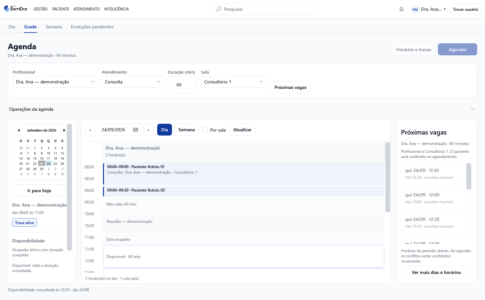
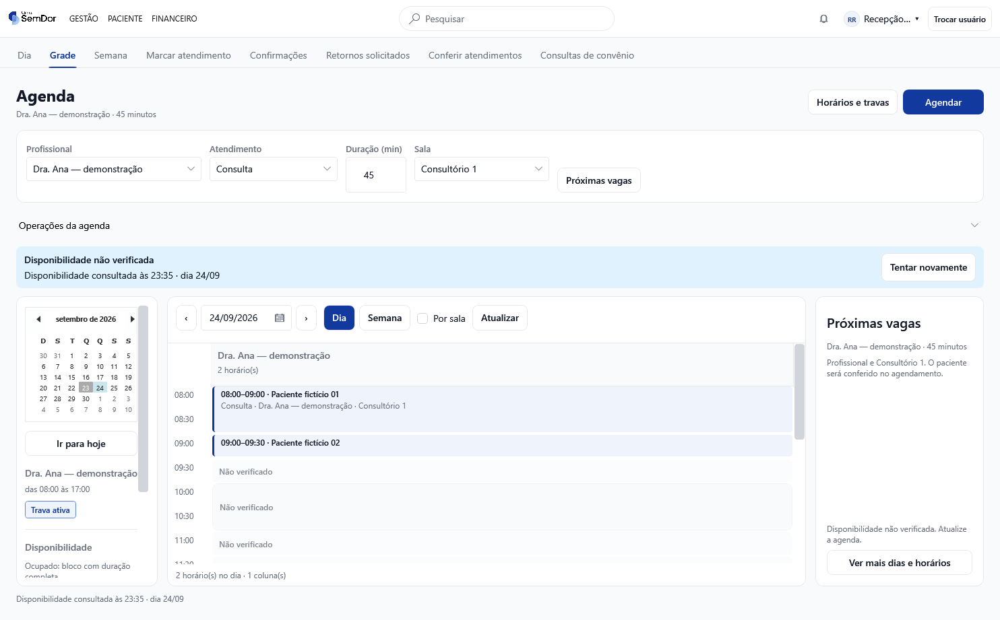
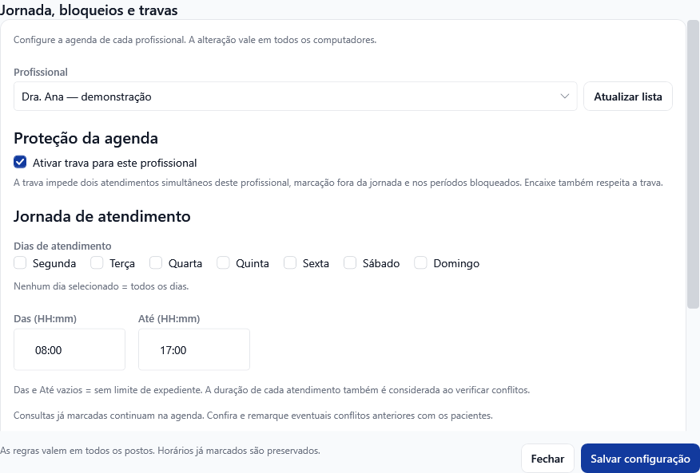
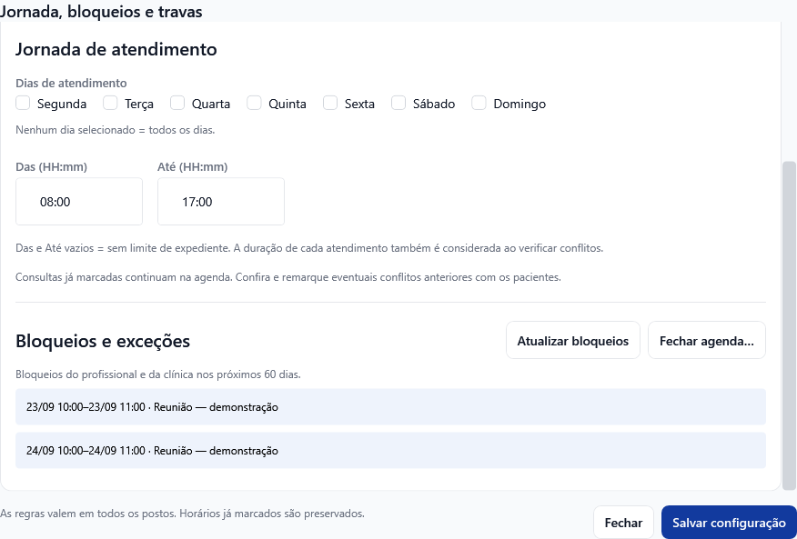
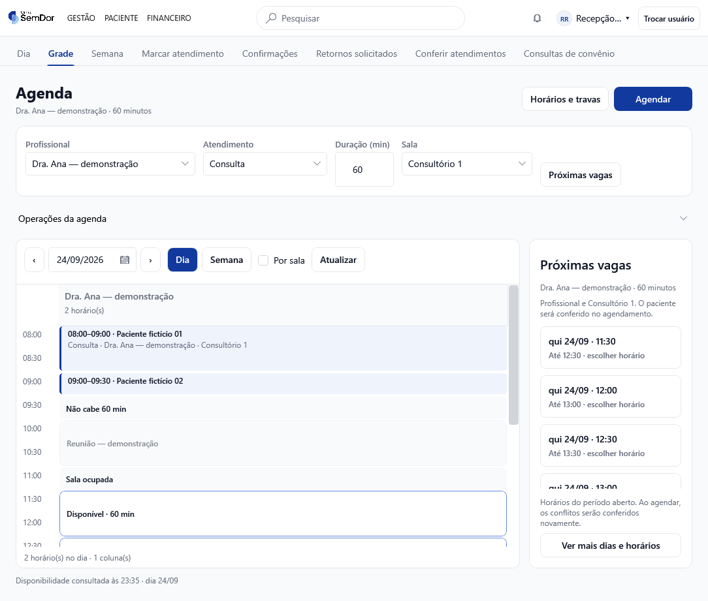

# Agenda Modelo A — implementação na PR #205

Esta é a implementação da nova organização da agenda, com capturas do aplicativo WPF real. O diagnóstico e os protótipos anteriores continuam disponíveis como referência. As imagens desta página usam exclusivamente dados fictícios e banco SQLite isolado; não são capturas de produção.

## O que mudou de fato

- Calendário para escolher a data, filtro de profissional que inclui quem ainda não tem horários, modalidade, duração e sala.
- Dia e Semana dentro do planejamento, preservando o profissional escolhido.
- Atendimentos desenhados em blocos contínuos, com a duração real. Sobreposições ficam lado a lado.
- Próximas vagas na própria agenda; a consulta cruza profissional, jornada, bloqueios e capacidade da sala selecionada.
- Mensagens como “Não cabe 60 min”, “Sala ocupada” e “Disponibilidade não verificada”. Espaço vazio não é anunciado automaticamente como vaga.
- Agendar abre o formulário existente com o contexto preenchido. Consultar ou escolher uma vaga não grava atendimento.
- Jornada, trava e consulta dos bloqueios reunidas na mesma janela. As operações existentes continuam acessíveis.
- Agenda do dia da Recepção e Meu dia do Clínico com o Modelo A, mantendo as ações e seus destinos.

## 1. Planejamento diário — Recepção

No cenário demonstrativo, a profissional está ocupada até 09h30 e bloqueada das 10h às 11h. A sala é usada por outra médica até 11h30. Para 60 minutos, a primeira vaga conjunta começa às **11h30**.

## 2. Semana do profissional escolhido

O mesmo filtro permanece ao alternar Dia/Semana. A legenda usa texto além da cor. A barra de rolagem permite consultar o restante da jornada.

## 3. Planejamento no módulo Clínico

O componente visual é o mesmo. A permissão do usuário continua determinando quais ações de marcação estão disponíveis.

## 4. Recepção — atendimentos do dia

Continuam os comandos atuais de chegada, edição e conclusão, conforme o estado e a permissão. Nenhuma mudança de estado clínico foi acrescentada por esta revisão visual.

## 5. Clínico — Meu dia

Atender e Ver registro mantêm seus destinos. Evoluções, assinaturas, encerramento e geração de guias não foram modificados.

## 6. Falha de leitura identificada

Exemplo de estado simulado: a última consulta fica identificada, a tela pede nova leitura e deixa de oferecer disponibilidade como confirmada.

## 7. Jornada, bloqueios e trava

## 8. Janela menor

O calendário lateral recolhe para priorizar a grade. O seletor de data continua visível.

## Cobertura das 12 recomendações do diagnóstico

| Item | Entrega e limite |
|---|---|
| 01 — Médico | Seletor no planejamento inclui profissionais ativos sem horários; preservado entre Dia/Semana e vagas. O filtro da fila operacional mantém sua regra atual. |
| 02 — Semana | Novo planejamento com Dia/Semana. A visão clínica anterior de sessões da semana mantém sua rota e comandos. |
| 03 — Data | Calendário lateral e seletor de data acessível também em janela menor. |
| 04 — Duração | Disponibilidade calculada pela duração informada, com indicação dos intervalos insuficientes. |
| 05 — Próximas vagas | Integrada ao planejamento e ao formulário atual. Busca a partir da data escolhida por até 60 dias. Filtro específico por turno não foi acrescentado. |
| 06 — Recursos | Sala e capacidade entram no cálculo. O paciente é selecionado e seus conflitos são conferidos no formulário atual; não há um novo seletor de paciente na grade nem contador visual de lugares ocupados. |
| 07 — Blocos | Duração contínua, horários intermediários e sobreposições visuais. |
| 08 — Leitura incompleta | Aviso, última leitura, atualização e remoção das vagas não verificadas. |
| 09 — Jornada | Interface consolidada, mantendo uma faixa de horário para os dias escolhidos e bloqueios por data. Jornadas diferentes por dia e múltiplos intervalos não estão implementados: ampliam o cadastro e as regras atuais e foram consultados separadamente com o usuário. |
| 10 — Trava | Estado visível no contexto do profissional e configuração existente preservada. |
| 11 — Ações | Agendar em destaque e operações relacionadas agrupadas. As rotas e funções existentes continuam disponíveis. |
| 12 — Contexto | Profissional/data/duração/sala/modalidade preenchidos na marcação; busca anterior invalidada quando o filtro muda. Reconferência ao salvar e lista de espera seguem o comportamento existente, sem nova automação. |

Portanto, esta entrega implementa a nova interface e sua consulta de disponibilidade; não representa a implementação integral de todas as ampliações funcionais sugeridas no diagnóstico.

## Revisão e verificação

- Consulta real ao Jev pela TypeSafe, modelo resolvido `jev-1.13.0`, sobre os trechos alterados, preservação do fluxo, respostas antigas e disponibilidade por sala. A inspeção visual foi feita no aplicativo WPF por Codex.
- O ponto de atenção sobre limites do período levou à correção da leitura de ocupações que atravessam a meia-noite, com teste de regressão.
- Testes de domínio/aplicação/infraestrutura: **2.854 aprovados**. Os novos cenários cobrem sala, capacidade, paciente, cancelamentos e ocupação na virada do dia.
- Verificador estático: **217 XAML, 10 projetos e 136 construtores de ViewModel** conferidos.
- Compilação de sombra dos **11 projetos WPF** e execução nativa do verificador de layout.
- Integração nativa: profissional sem horários, filtro preservado na semana, falha de leitura sem vagas, botão disponível no primeiro carregamento e abertura do formulário sem gravação no banco.
- Capturas em SQLite isolado, sem exceções e sem erros de binding. Uma falha de layout no primeiro carregamento e outra de redução da janela foram corrigidas durante esta conferência.

**Publicação:** alterações destinadas à PR #205. Estas imagens não significam implantação na VPS nem atualização dos executáveis da clínica. O resultado do CI deve ser conferido no commit da PR.
