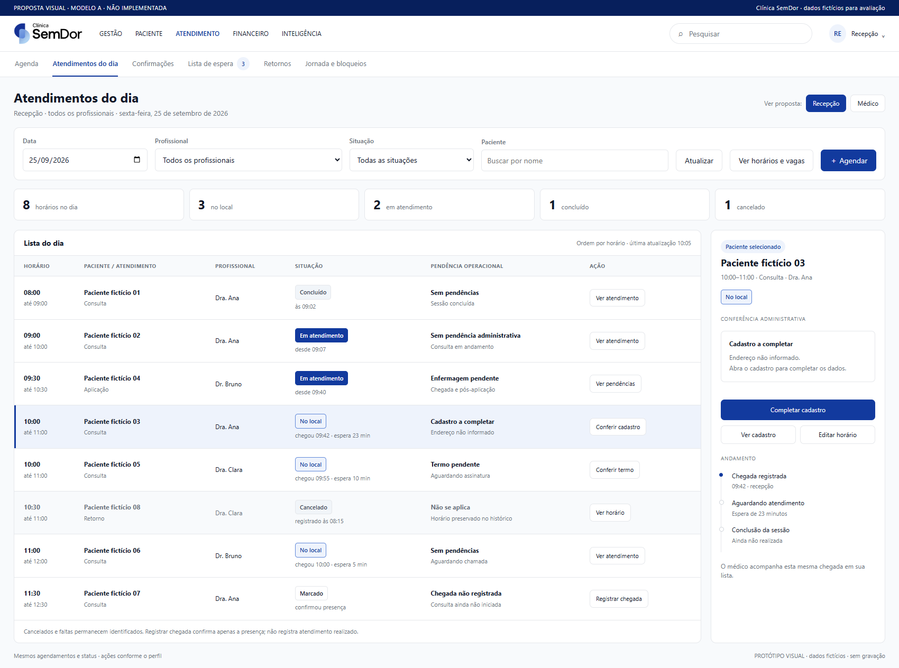
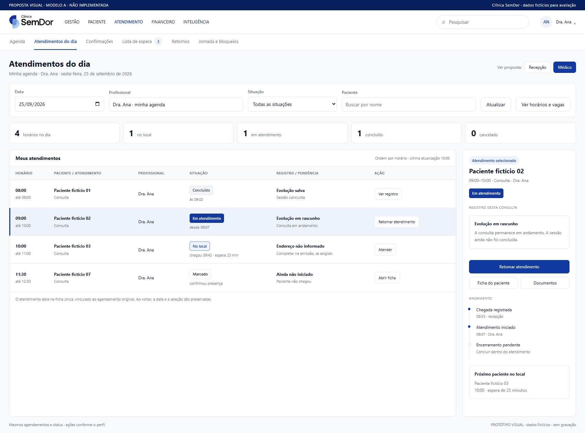
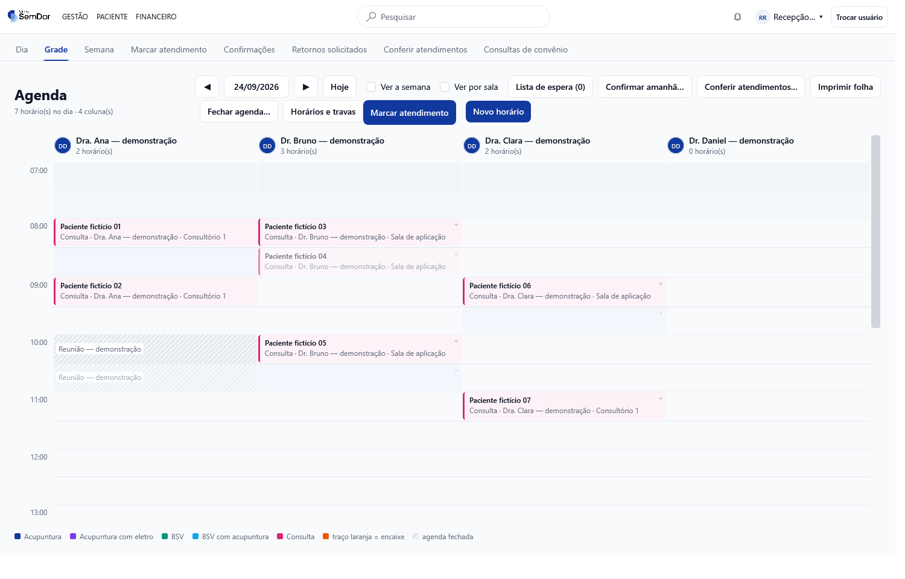
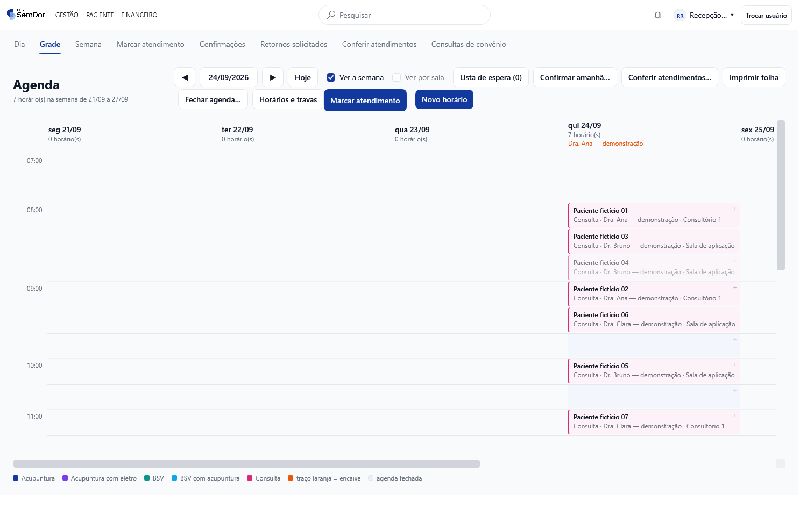
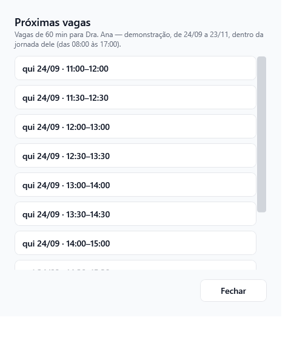
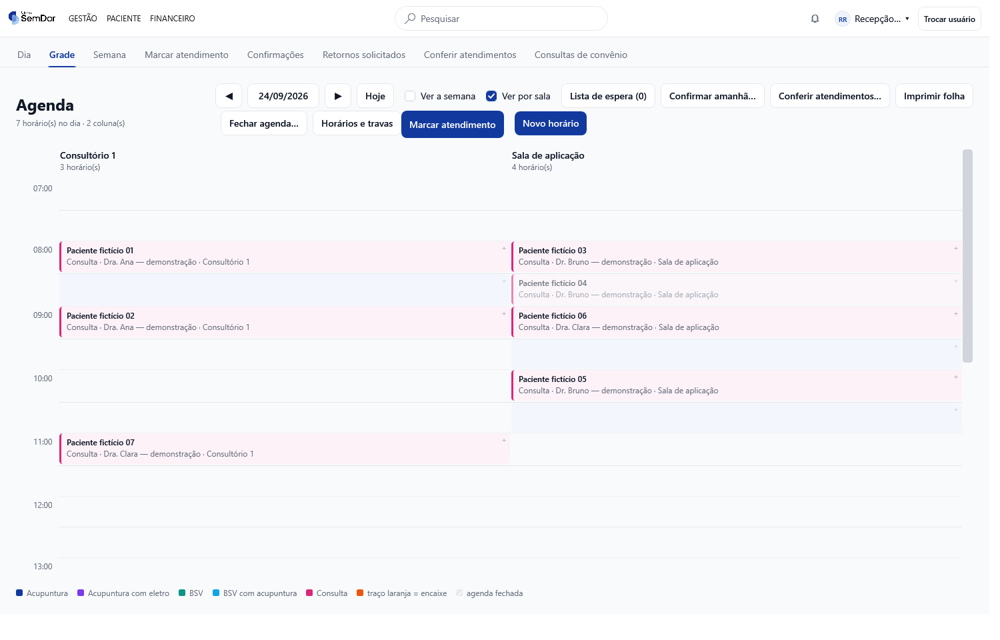
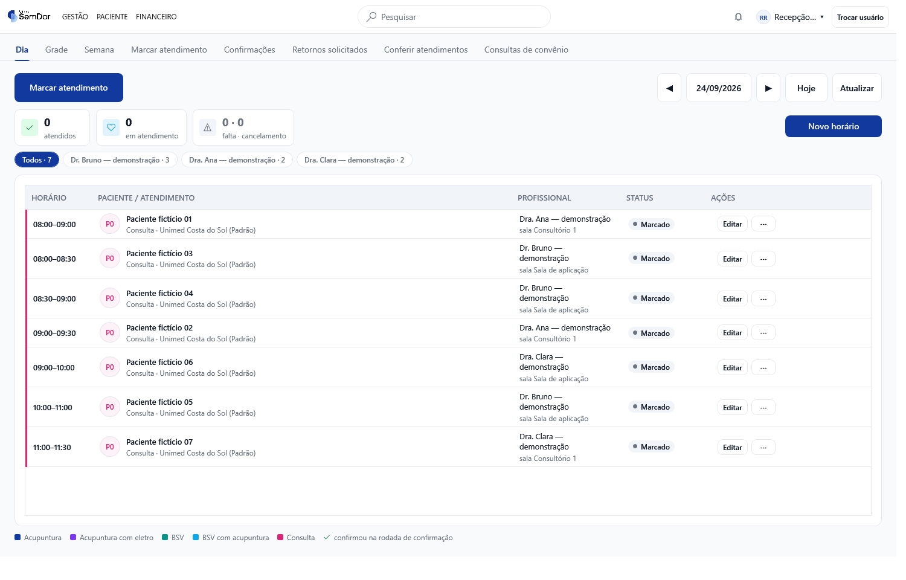
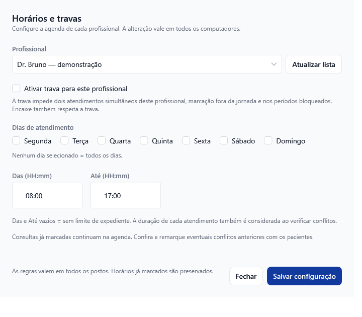
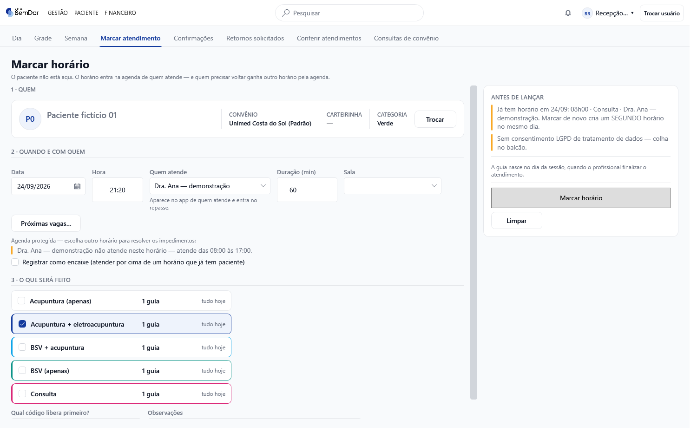
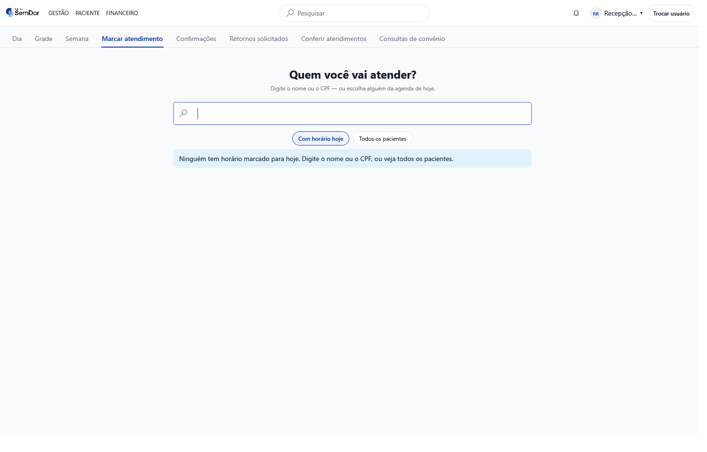

# Agenda SemDor — como ficará e evidências atuais

**PR #205 · revisão com Jev · Modelo A.** Sete imagens de propostas visuais e oito capturas reais da versão atual, todas com dados fictícios. As propostas de agenda ainda não estão implementadas no aplicativo.

## Acesso e download

- [Relatório completo com as sete imagens propostas e 12 recomendações](DIAGNOSTICO-AGENDA.md)
- [Baixar ZIP com relatório, 15 imagens e protótipos](https://github.com/lucaszaous-creator/Clinica/raw/refs/heads/codex/navegacao-unificada/docs/revisoes/agenda-pr205/agenda-fotos-e-relatorio.zip)

As imagens aparecem diretamente no GitHub, sem depender da rede local. Para usar o pacote, extraia o ZIP e abra `index.html`; os protótipos também funcionam sem servidor.

## Como propomos deixar — imagens das novas telas

**Sete capturas de protótipos HTML renderizados no navegador, seguindo o Modelo A:** logo oficial, paleta do design system e tipografia Segoe UI. São propostas visuais, ainda não implementadas no aplicativo WPF nem publicadas em produção. A navegação do protótipo é parcial; os controles não consultam nem gravam no banco.

Todos os dados exibidos são fictícios. As oito capturas WPF da versão atual continuam na [galeria de evidências](README.md#capturas-reais-da-versão-atual). As imagens abaixo mostram concretamente como recomendamos organizar a agenda.

### Proposta 1. Agenda diária de cada médico

Profissional, duração e sala no mesmo cabeçalho; calendário para saltar de data; horários ocupados, bloqueados e disponíveis desenhados pela duração. No exemplo, a primeira vaga conjunta é 11h30–12h30.

[Comparar com a tela atual](fotos/02-grade-profissionais.png).

### Proposta 2. Semana completa do médico selecionado

O médico permanece selecionado ao trocar entre Dia e Semana. A jornada e os intervalos ficam visíveis; sexta-feira à tarde aparece fora do expediente.

[Comparar com a tela atual](fotos/03-grade-semana.png).

### Proposta 3. Encontrar uma vaga que realmente comporte a consulta

A busca considera profissional, sala, capacidade, paciente e duração. Mostra por que 09h30 não comporta 60 minutos e por que 11h conflita com a sala. Continuar leva ao agendamento completo.

[Comparar com a tela atual](fotos/07-proximas-vagas.png).

### Proposta 4. Jornada, intervalos, bloqueios e trava juntos

Configuração por dia da semana, mais de um intervalo de trabalho, exceções por data e estado da trava. A função Marcar permanece disponível pelo botão Agendar; a proposta preserva séries, encaixes e validações.

[Comparar com a tela atual](fotos/05-horarios-travas.png).

### Proposta 5. Falha de atualização com mensagem clara

Quando não for possível conferir os bloqueios, manter a última leitura identificada e pedir atualização. Não apresentar espaços vazios como vagas confirmadas. Este é um novo estado proposto, sem captura equivalente da versão atual.

## Atendimentos do dia — recepção e médicos

**Uma mesma aba, com ações conforme o perfil.** A recepção abre todos os profissionais; o médico abre sua agenda. Horários, chegada, espera e situação vêm dos mesmos registros. As ações e os dados clínicos seguem as permissões.

### Proposta 6. Visão da recepção

### Proposta 7. Visão do médico

[Leia o fluxo completo, as ações por perfil e as regras das duas evoluções de enfermagem](FLUXO-DO-DIA.md).

## Capturas reais da versão atual

### 1. Grade por profissional

A grade já mostra os profissionais, mas falta um seletor persistente para consultar a agenda completa de um médico.

### 2. Semana da grade

A recepção vê profissionais reunidos por dia. Recomendamos manter a escolha do médico entre Dia e Semana.

### 3. Próximas vagas

Função que já existe: considera profissional, duração, jornada e bloqueios. Recomendamos integrá-la à agenda e cruzar sala/capacidade.

### 4. Grade por sala

O Consultório 1 está ocupado às 11h no exemplo. Disponibilidade do médico não significa disponibilidade dessa sala.

### 5. Lista do dia

O filtro atual lista os profissionais com horários. A proposta inclui também os profissionais sem agendamentos.

### 6. Horários e travas

A configuração atual utiliza uma faixa Das/Até. Recomendamos intervalos por dia e exceções por data.

### 7. Marcar atendimento

O formulário real contém Próximas vagas e avisos de conflito. Esse fluxo completo deve ser preservado.

### 8. Entrada da marcação

A marcação começa pela seleção do paciente.

