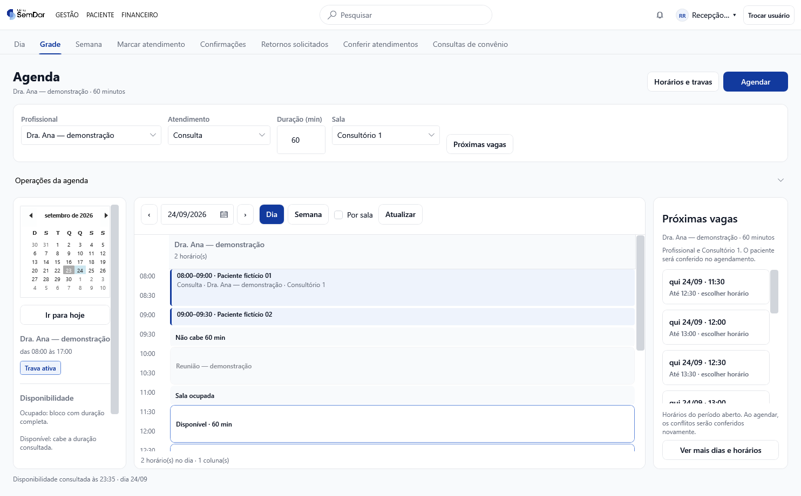
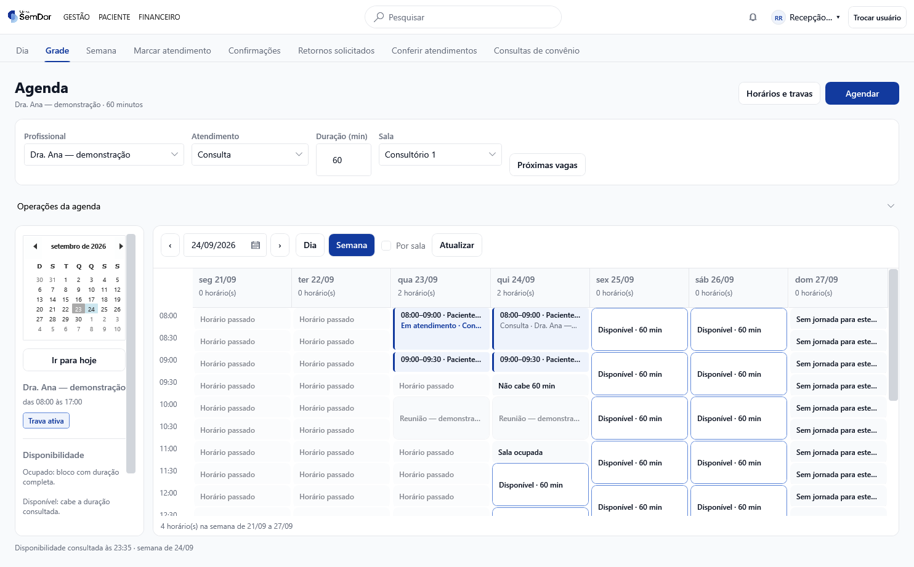
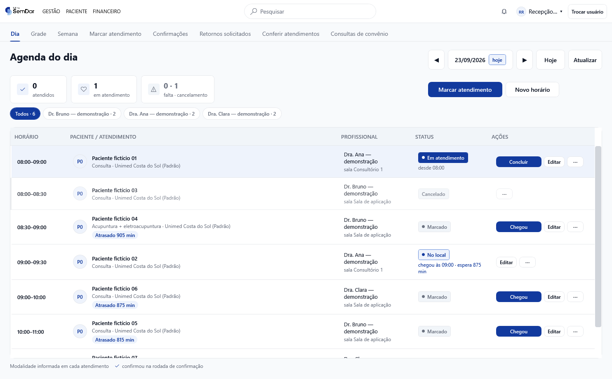
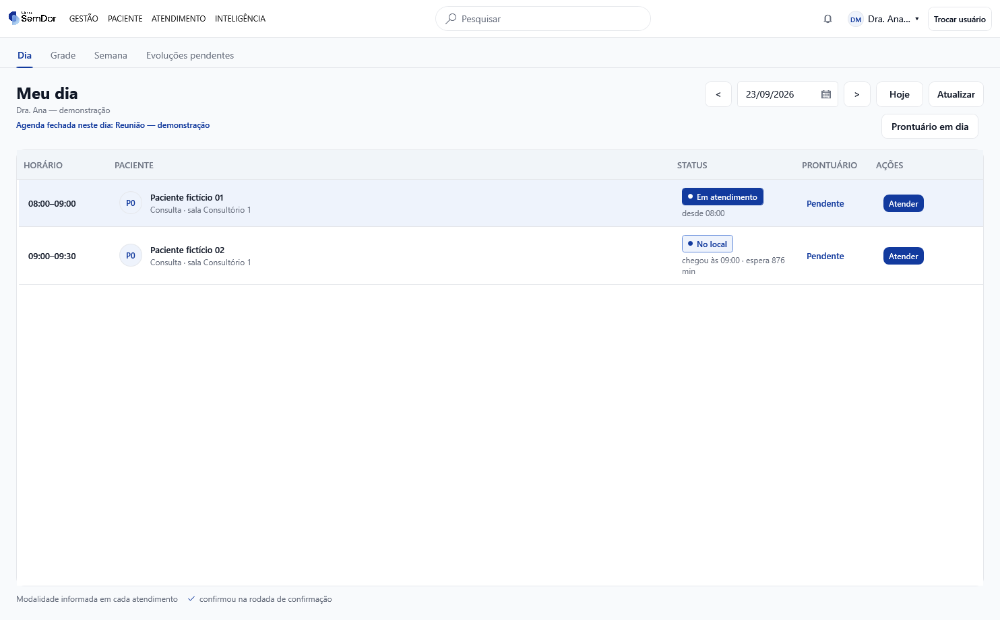

# Agenda SemDor — Modelo A implementado

**PR #205 · revisão com Jev · aplicativo WPF real.** As imagens abaixo mostram a nova organização da agenda, executada com dados fictícios em banco isolado. Não representam implantação em produção.

- [Relatório da implementação, imagens e cobertura das 12 recomendações](IMPLEMENTACAO-MODELO-A.md)
- [Revisão final com Jev: falhas corrigidas e testes](REVISAO-FINAL.md)
- [Diagnóstico aprovado e protótipos de referência](DIAGNOSTICO-AGENDA.md)
- [Fluxo do dia: ações preservadas](FLUXO-DO-DIA.md)
- [Histórico das telas anteriores](HISTORICO-PROPOSTAS.md)
- [Baixar relatório e imagens para consultar offline](https://github.com/lucaszaous-creator/Clinica/raw/refs/heads/codex/navegacao-unificada/docs/revisoes/agenda-pr205/agenda-fotos-e-relatorio.zip)

As imagens abrem diretamente no GitHub, sem depender de rede local. No ZIP, extraia os arquivos e abra `index.html`.

## Planejamento diário

## Semana do profissional

## Atendimentos do dia — Recepção

## Meu dia — Clínico

O [relatório completo](IMPLEMENTACAO-MODELO-A.md) inclui também planejamento no Clínico, janela menor, indisponibilidade da leitura, jornada, bloqueios, verificação e os limites das ampliações funcionais.
