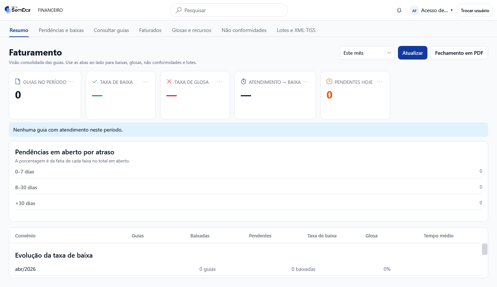

# Correção do escopo do aplicativo Faturamento — 24/09/2026

## Causa

A composição do executável carregava os menus `agenda`, `pacientes` e `ajuda` da Recepção, além de acessos e configurações da Direção. Como Gestão é o primeiro grupo do shell e não havia abertura específica, o aplicativo entrava na agenda. O teste anterior repetia essa composição sem exigir o escopo exclusivo do Faturamento.

## Correção

- Catálogo próprio do executável: apenas **Financeiro → Faturamento de guias**.
- Abertura em **Resumo**, seguida de **Pendências e baixas**, **Consultar guias**, **Faturados**, **Glosas e recursos**, **Não conformidades** e **Lotes e XML TISS**.
- Relatórios de guias e parâmetros TISS ficam no mesmo conjunto quando o acesso possui suas permissões. O perfil Faturista padrão mantém as sete abas acima.
- Agenda, fila, semana, confirmações, retornos, marcação, lista geral de pacientes e administração de usuários não são rotas desse executável, mesmo quando quem entra possui permissões amplas.
- Dependências da ficha administrativa usada na conferência de uma guia continuam registradas. Operações e permissões de guias são preservadas; nenhuma migration ou alteração do fluxo clínico.
- A composição dos demais aplicativos permanece a mesma.

## Evidência real

Captura do WPF com banco SQLite isolado e dados fictícios. Não é uma imagem da produção nem um mockup.

## Verificações

O verificador Windows compila o mesmo `ModuloFaturamentoAplicativo.cs` usado pelo executável. Valida os perfis Faturista e Gerente, abertura, subabas, materialização das rotas de guias, busca e rejeição de navegação direta para outros módulos. A conferência das fichas administrativas também permanece na rotina.

Execução nativa local: **342 verificações, zero falhas e log de bindings vazio**. Compilação de sombra dos 11 projetos WPF e verificador estático aprovados. CI, merge e versão distribuída devem ser conferidos na PR e no release correspondentes; esta captura não prova atualização de uma estação da clínica.
